# Çamaşırhane & Kuru Temizleme ERP

Bir çamaşırhanenin günlük işleyişini uçtan uca yöneten dört uygulamalık sistem:
sipariş alma, yıkama aşamalarının takibi, suya dayanıklı barkod etiket basımı,
kurye ile teslimat ve gün sonu kasa raporu.

> Kurulum ve çalıştırma adımları için **[KURULUM.md](KURULUM.md)** dosyasına bakın.

---

## Sistem Mimarisi

Sistemin merkezinde **tek bir API** vardır. Masaüstü, web ve mobil uygulamaların
hiçbiri veritabanına doğrudan bağlanmaz; hepsi HTTP/JSON ile bu API'ye konuşur.
Böylece iş kuralları tek yerde toplanır ve her istemci bağımsız olarak çalışabilir.

```
                        ┌──────────────────────┐
                        │     PostgreSQL       │
                        │     laundry_erp      │
                        └──────────▲───────────┘
                                   │
                        ┌──────────┴───────────┐
                        │   API (Express)      │
                        │   localhost:3101     │
                        └──▲────────▲────────▲─┘
                           │        │        │
              ┌────────────┘        │        └────────────┐
              │                     │                     │
   ┌──────────┴─────────┐ ┌─────────┴────────┐ ┌──────────┴─────────┐
   │  Kasa (WinForms)   │ │  Web Paneli      │ │  Mobil (Expo)      │
   │  Windows           │ │  React + Vite    │ │  Kurye + Müşteri   │
   │  Sipariş + etiket  │ │  localhost:5101  │ │  Android           │
   └────────────────────┘ └──────────────────┘ └────────────────────┘
```

---

## Kullanılan Teknolojiler

| Uygulama | Teknoloji | Klasör |
|----------|-----------|--------|
| API | Node.js 22, Express 5, PostgreSQL 16, JWT | `apps/api` |
| Web Yönetim Paneli | React 19, Vite, React Router, Axios | `apps/web-admin` |
| Mobil Uygulama | React Native, Expo SDK 57, React Navigation | `apps/mobile` |
| Kasa Uygulaması | C# WinForms (.NET 9), ZXing (Code128) | `apps/desktop-winforms` |

---

## Özellikler

**Sipariş yönetimi**
- Müşteri arama (ad, telefon veya ilçe) ve hızlı müşteri ekleme
- Çok kalemli sipariş oluşturma, canlı toplam hesabı
- Her kalem için otomatik barkod üretimi (`SP-2026-00001-01`)

**Aşama takibi**
- Teslim Alındı → Yıkamada → Ütüde → Hazır → Teslim Edildi
- Barkod okutarak tek tuşla aşama güncelleme
- Her değişiklik, kimin ne zaman yaptığıyla birlikte geçmişe kaydedilir
- Teslim edilmiş sipariş tekrar değiştirilemez

**Barkod etiket basımı**
- 60×40 mm etiket üzerine Code128 barkod, müşteri adı, hizmet ve tarih
- Yazdırma önizlemesi ve yazıcı seçimi

**Kurye ve teslimat**
- Kurye teslimi seçilen siparişlere otomatik görev açılır
- Kurye mobil uygulamadan görevlerini görür: Bekleyen / Yolda / Tamamlanan
- Kapıda tahsilat (nakit/kart) ve teslim onayı
- Teslim tamamlanınca sipariş otomatik "Teslim Edildi" olur

**Müşteri sipariş takibi**
- Giriş gerektirmez; sipariş numarası veya etiket barkodu ile sorgulanır
- Siparişin hangi aşamada olduğu ve aşama geçmişi zaman çizelgesinde gösterilir

**Tahsilat ve raporlama**
- Kısmi ödeme desteği; kalan borçtan fazla tahsilat engellenir
- Gün sonu kasa raporu: ciro, teslim edilen, nakit/kart/havale dağılımı
- Yönetim paneli özeti: aşama dağılımı, aylık ciro, en çok gelir getiren hizmetler
- Raporlar yazdırılabilir

---

## Ekran Görüntüleri

### Web Yönetim Paneli

| Panel | Siparişler |
|-------|------------|
| 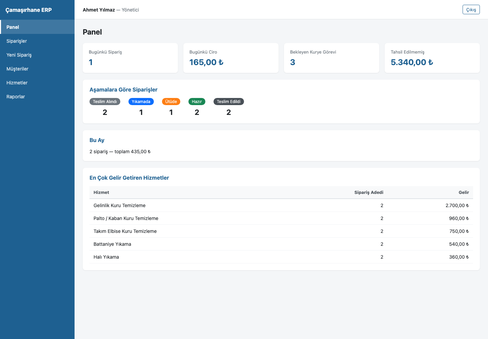 | 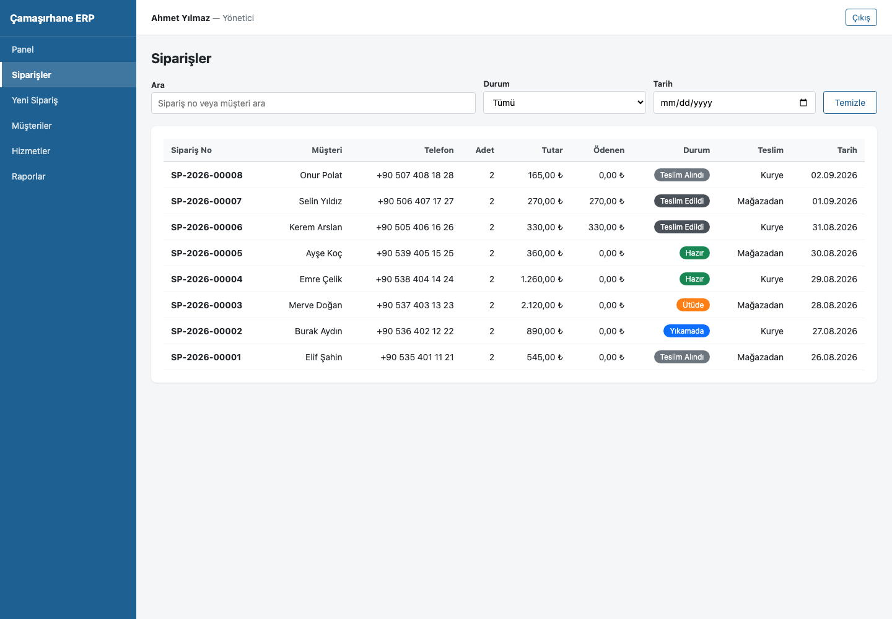 |

| Sipariş Detayı | Yeni Sipariş |
|----------------|--------------|
| 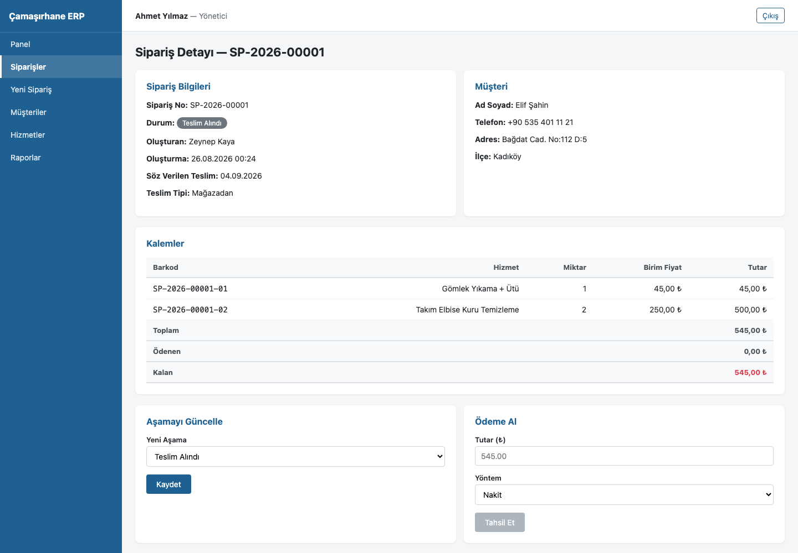 | 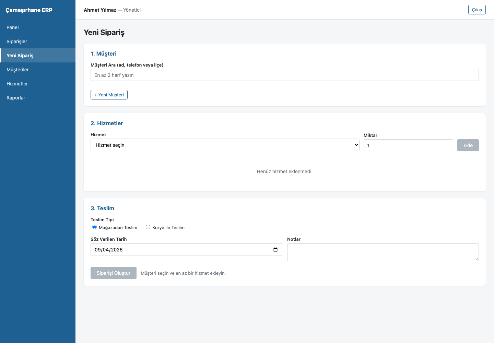 |

| Müşteriler | Gün Sonu Raporu |
|------------|-----------------|
| 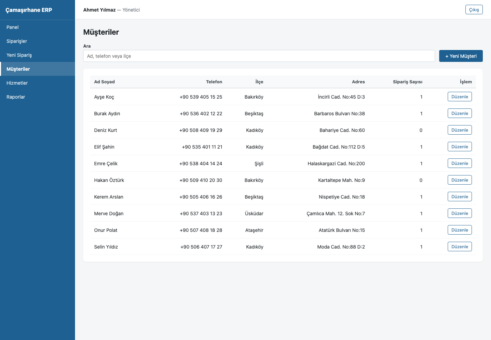 | 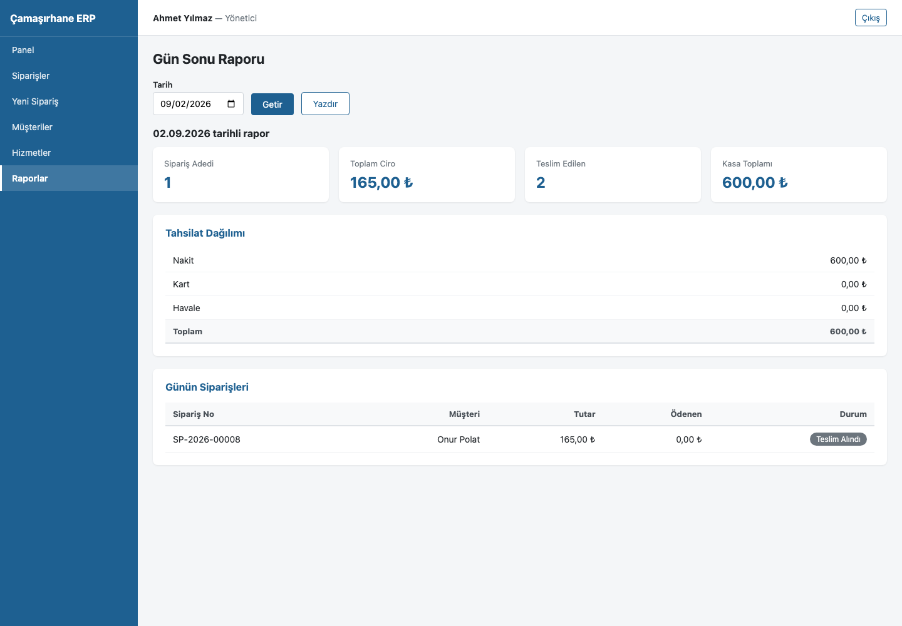 |

### Mobil Uygulama

| Ana Ekran | Sipariş Takibi | Kurye Görevleri |
|-----------|----------------|-----------------|
| 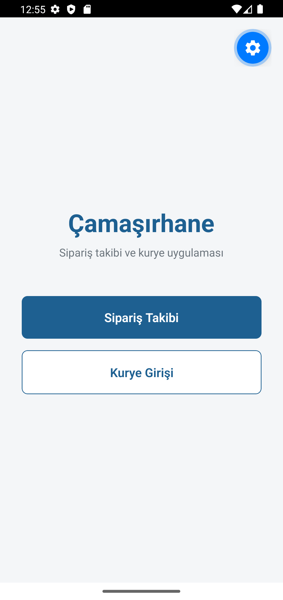 | 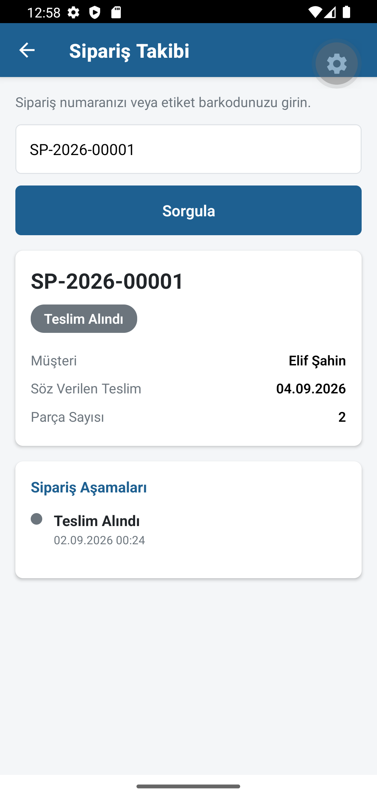 | 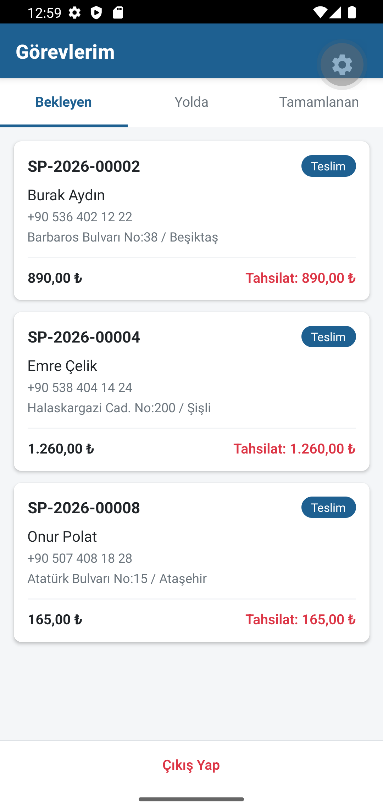 |

| Görev Detayı | Kapıda Tahsilat |
|--------------|-----------------|
| 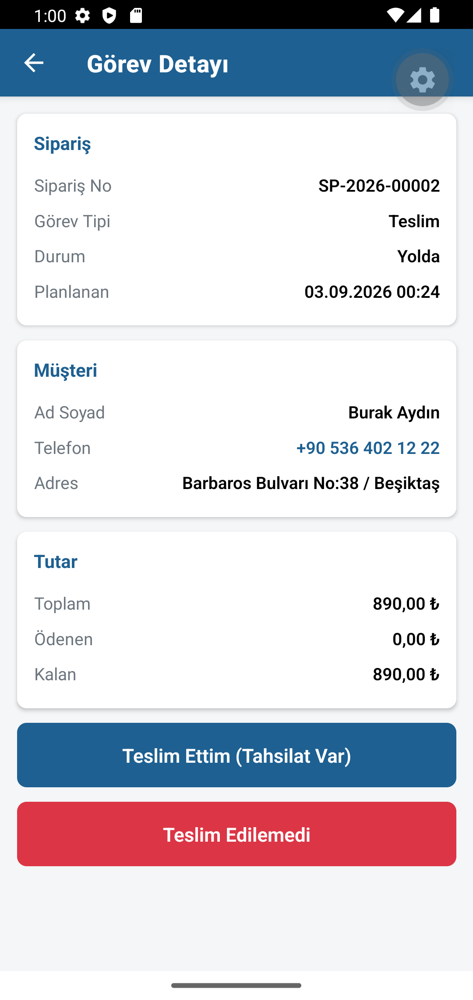 | 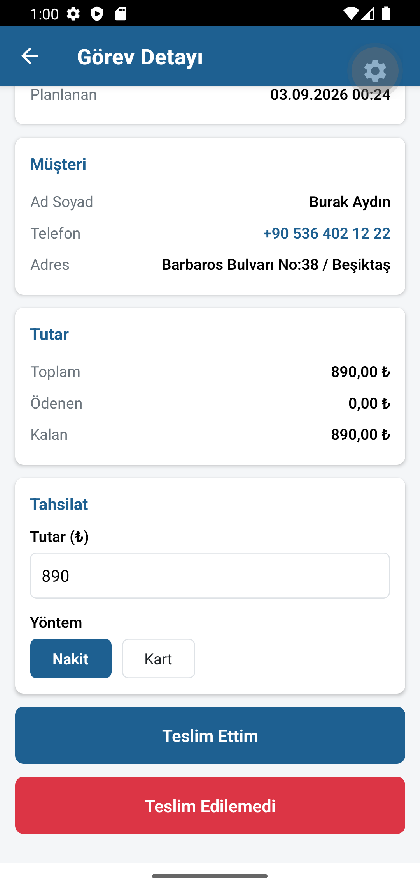 |

---

## Demo Hesapları

| Kullanıcı Adı | Şifre | Rol |
|---------------|-------|-----|
| `admin` | `123456` | Yönetici |
| `kasiyer1` | `123456` | Kasiyer |
| `kurye1` | `123456` | Kurye |

---

## Veritabanı Şeması

| Tablo | Açıklama |
|-------|----------|
| `users` | Personel: yönetici, kasiyer, kurye |
| `customers` | Müşteriler (ad, telefon, adres, ilçe) |
| `services` | Hizmetler ve fiyatlar (yıkama, kuru temizleme, ütü, leke) |
| `orders` | Siparişler: durum, teslim tipi, tutar, ödenen, söz verilen tarih |
| `order_items` | Sipariş kalemleri — her satırın kendi barkodu vardır |
| `order_status_history` | Aşama değişiklik geçmişi (kim, ne zaman, hangi not) |
| `courier_tasks` | Kurye alma/teslim görevleri |
| `payments` | Tahsilatlar (nakit / kart / havale) |

---

## API Uçları

| Metot | Yol | Açıklama |
|-------|-----|----------|
| POST | `/api/auth/login` | Giriş, JWT token döner |
| GET | `/api/auth/me` | Giriş yapan kullanıcının bilgisi |
| GET | `/api/customers?q=` | Müşteri arama (ad, telefon, ilçe) |
| GET | `/api/customers/:id` | Müşteri detayı ve sipariş geçmişi |
| POST/PUT | `/api/customers` | Müşteri ekleme / güncelleme |
| GET | `/api/services?active=1` | Hizmet listesi |
| POST/PUT | `/api/services` | Hizmet ekleme / güncelleme (yönetici) |
| POST | `/api/orders` | Yeni sipariş (barkodlar burada üretilir) |
| GET | `/api/orders?status=&q=&date=` | Filtreli sipariş listesi |
| GET | `/api/orders/:id` | Sipariş detayı, kalemler, geçmiş, ödemeler |
| PUT | `/api/orders/:id/status` | Aşama güncelleme |
| GET | `/api/orders/barcode/:barkod` | Barkoddan sipariş bulma |
| PUT | `/api/orders/barcode/:barkod/status` | Barkod okutarak aşama güncelleme |
| POST | `/api/payments` | Tahsilat |
| GET | `/api/couriers/tasks?status=` | Kurye görevleri |
| PUT | `/api/couriers/tasks/:id/status` | Görev durumu güncelleme |
| GET | `/api/reports/daily?date=` | Gün sonu kasa raporu |
| GET | `/api/reports/summary` | Yönetim paneli özeti |
| GET | `/api/track/:kod` | **Giriş gerektirmez** — müşteri sipariş takibi |
