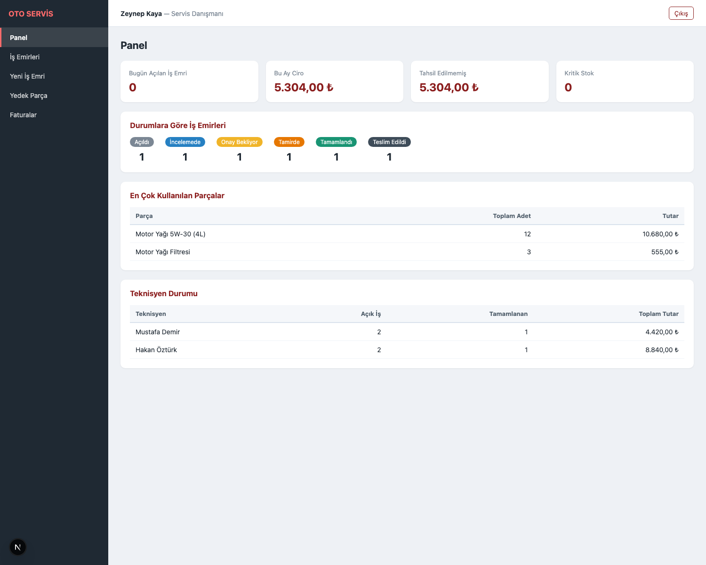
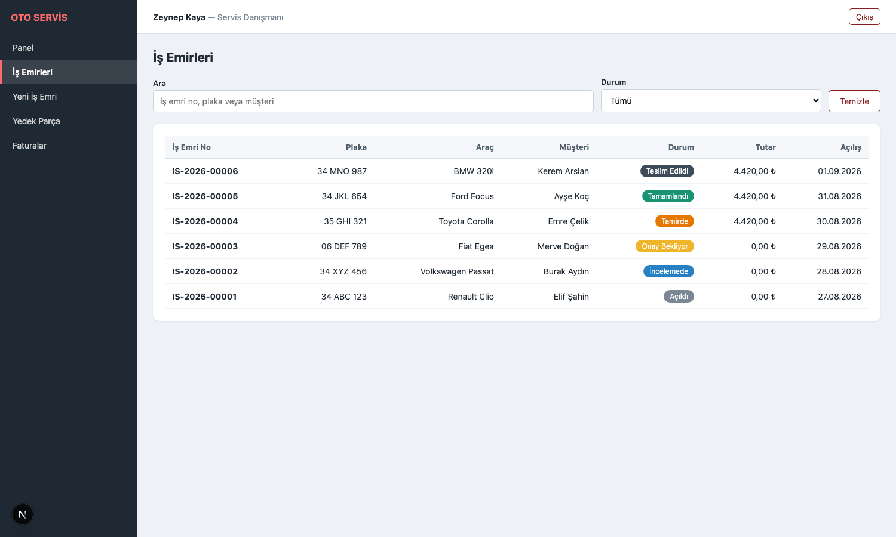
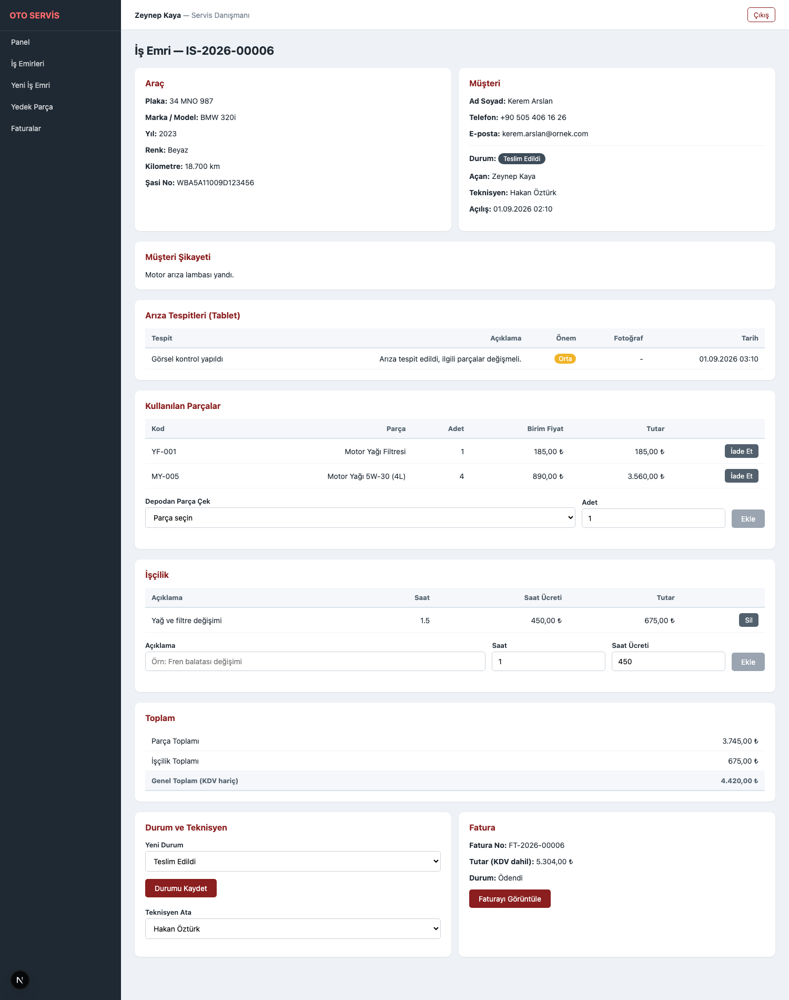
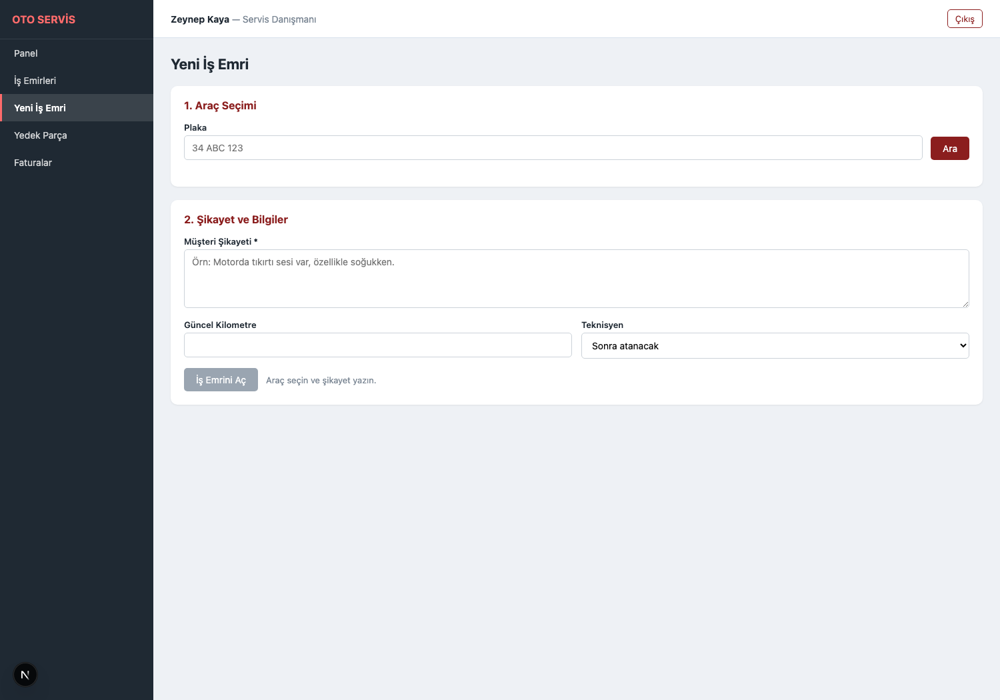
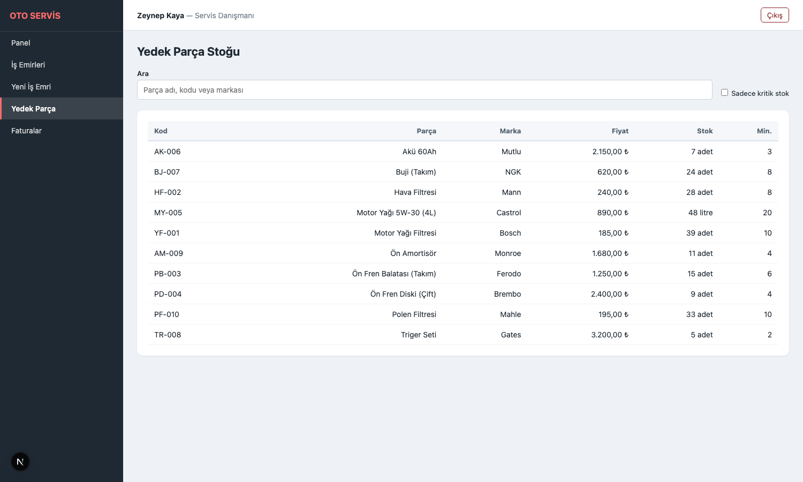
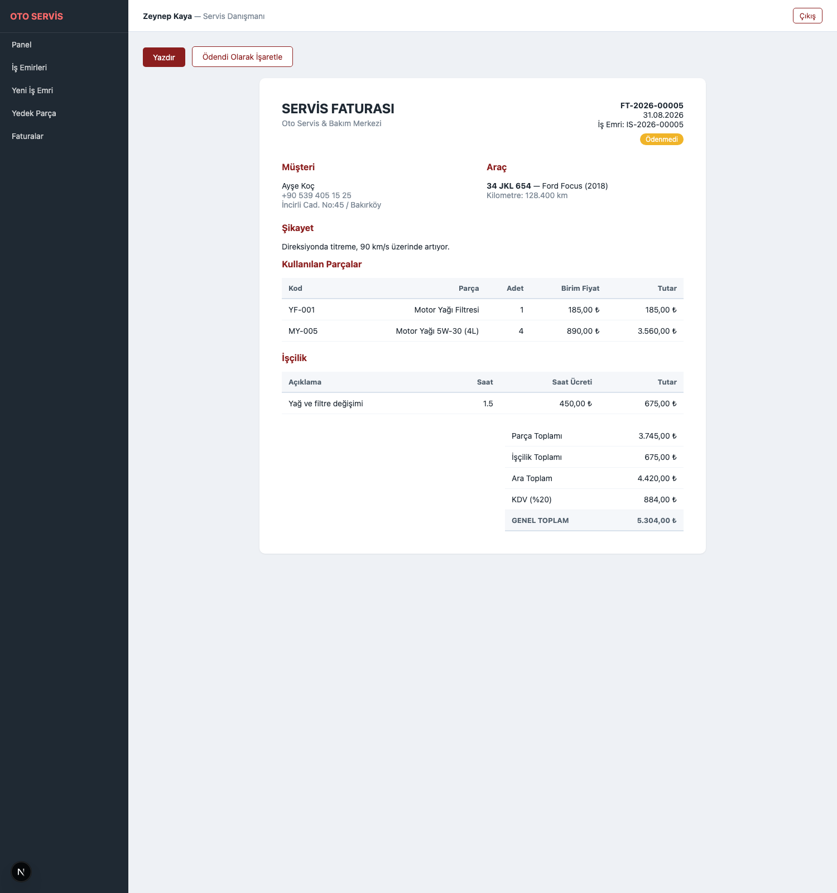
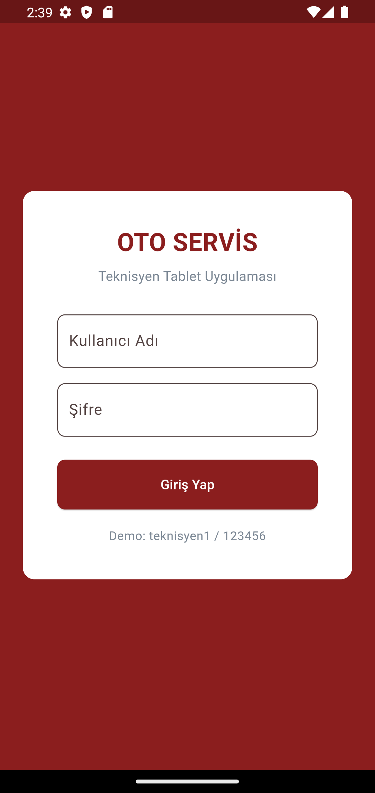
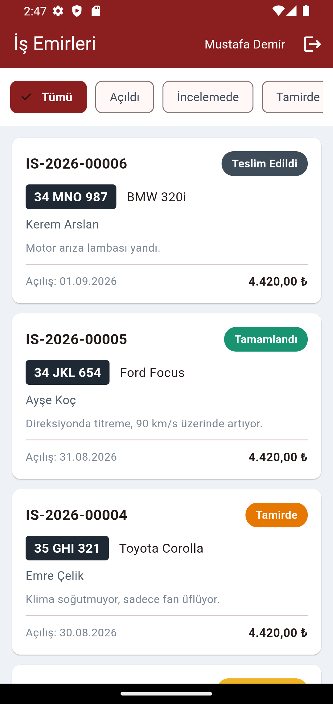
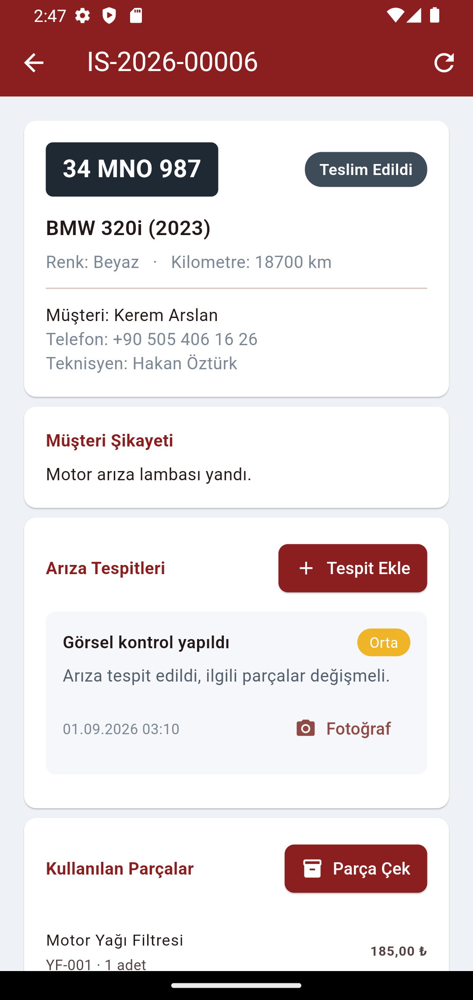

# Oto Servis & Bakım Yönetimi

Bir oto servisin iş akışını uçtan uca yöneten üç uygulamalık sistem: plakadan araç
bulup iş emri (Job Card) açma, tablet üzerinden arıza tespiti ve fotoğraf çekme,
depodan parça çekme, işçilik girişi ve KDV'li servis faturası kesme.

> Kurulum ve çalıştırma adımları için **[KURULUM.md](KURULUM.md)** dosyasına bakın.

---

## Sistem Mimarisi

Merkezde **ASP.NET Core API** vardır. Yönetim paneli ve tablet uygulaması yalnızca
bu API'ye HTTP/JSON ile konuşur; veritabanına doğrudan erişen tek bileşen API'dir.

```
                     ┌──────────────────────────┐
                     │  SQL Server (Docker)     │
                     │  garage_db               │
                     └────────────▲─────────────┘
                                  │ EF Core
                     ┌────────────┴─────────────┐
                     │  API (ASP.NET Core 9)    │
                     │  localhost:5102          │
                     └──▲────────────────────▲───┘
                        │                    │
          ┌─────────────┘                    └──────────────┐
          │                                                 │
 ┌────────┴──────────────┐                      ┌───────────┴─────────┐
 │  Yönetim Paneli       │                      │  Tablet (Flutter)   │
 │  Next.js 16           │                      │  Teknisyen          │
 │  localhost:3102       │                      │  Arıza tespiti      │
 │  İş emri, fatura, stok│                      │  + fotoğraf         │
 └───────────────────────┘                      └─────────────────────┘
```

---

## Kullanılan Teknolojiler

| Uygulama | Teknoloji | Klasör |
|----------|-----------|--------|
| API | ASP.NET Core 9, EF Core 9, SQL Server 2022, JWT, BCrypt | `apps/api` |
| Yönetim Paneli | Next.js 16 (App Router), React 19 | `apps/dashboard` |
| Tablet Uygulaması | Flutter 3.24.5, http, image_picker, shared_preferences | `apps/tablet` |
| Veritabanı | SQL Server 2022 (Docker) | `docker-compose.yml` |

---

## İş Emri Akışı

```
Açıldı ──▶ İncelemede ──▶ Onay Bekliyor ──▶ Tamirde ──▶ Tamamlandı ──▶ Teslim Edildi
```

- Tablet üzerinden ilk arıza tespiti girildiğinde iş emri otomatik olarak
  **İncelemede** durumuna geçer.
- **Teslim Edildi** durumundaki iş emri artık değiştirilemez ve parça eklenemez.
- Fatura yalnızca **Tamamlandı** veya **Teslim Edildi** durumundaki iş emirleri
  için kesilebilir.

---

## Özellikler

**İş emri yönetimi**
- Plakadan araç arama, araç ve müşteri bilgisiyle iş emri açma
- Otomatik iş emri numarası (`IS-2026-00001`)
- Teknisyen atama, durum takibi, kilometre güncelleme

**Tablet ile arıza tespiti**
- Teknisyen kendi iş emirlerini durum sekmeleriyle listeler
- Tespit başlığı, açıklama ve önem derecesi (Düşük / Orta / Yüksek)
- Kamera veya galeriden fotoğraf ekleme (en fazla 8 MB)
- Tabletten doğrudan depodan parça çekme

**Depo ve stok**
- Parça kodu, marka, birim fiyat, stok ve kritik stok seviyesi
- Parça çekildiğinde stok otomatik düşer; **stok yetersizse işlem engellenir**
- Yanlış çekilen parça iade edilir ve stoğa geri eklenir
- Kritik stok filtresi ve yönetici için mal girişi

**Faturalama**
- Parça + işçilik toplamları iş emri üzerinde canlı hesaplanır
- KDV %20 ile fatura kesme, yazdırılabilir fatura ekranı
- Ödendi işaretleme, ödenmemiş fatura takibi

**Raporlama**
- Durumlara göre iş emri dağılımı, aylık ciro, tahsil edilmemiş tutar
- En çok kullanılan parçalar
- Teknisyen performansı (açık iş, tamamlanan iş, üretilen ciro)

---

## Ekran Görüntüleri

### Yönetim Paneli (Next.js)

| Panel | İş Emirleri |
|-------|-------------|
|  |  |

| İş Emri Detayı | Yeni İş Emri |
|----------------|--------------|
|  |  |

| Yedek Parça | Servis Faturası |
|-------------|-----------------|
|  |  |

### Tablet Uygulaması (Flutter)

| Giriş | İş Emirleri | İş Emri Detayı |
|-------|-------------|----------------|
|  |  |  |

---

## Demo Hesapları

| Kullanıcı Adı | Şifre | Rol |
|---------------|-------|-----|
| `admin` | `123456` | Yönetici |
| `danisman1` | `123456` | Servis Danışmanı |
| `teknisyen1` | `123456` | Teknisyen |
| `teknisyen2` | `123456` | Teknisyen |

---

## Veritabanı Tabloları

| Tablo | Açıklama |
|-------|----------|
| `Users` | Personel: admin, danisman, teknisyen |
| `Customers` | Müşteriler |
| `Vehicles` | Araçlar — plaka benzersizdir |
| `JobCards` | İş emirleri (Job Card) |
| `InspectionItems` | Arıza tespitleri + fotoğraf yolu |
| `Parts` | Yedek parça stoğu |
| `JobParts` | İş emrine çekilen parçalar |
| `LaborItems` | İşçilik kalemleri |
| `Invoices` | Faturalar (KDV dahil) |

---

## API Uçları

| Metot | Yol | Açıklama |
|-------|-----|----------|
| POST | `/api/auth/login` | Giriş, JWT token |
| GET | `/api/customers?q=` | Müşteri arama (ad, telefon, plaka) |
| GET | `/api/vehicles?plaka=` | Plakadan araç bulma |
| POST | `/api/vehicles` | Araç ekleme |
| GET | `/api/jobcards?status=&q=&date=` | İş emri listesi |
| GET | `/api/jobcards/{id}` | İş emri detayı (tespit, parça, işçilik, fatura) |
| POST | `/api/jobcards` | Yeni iş emri |
| PUT | `/api/jobcards/{id}/status` | Durum güncelleme |
| PUT | `/api/jobcards/{id}/technician/{tid}` | Teknisyen atama |
| POST | `/api/jobcards/{id}/inspection` | Arıza tespiti ekleme |
| POST | `/api/jobcards/inspection/{id}/photo` | Fotoğraf yükleme (multipart) |
| POST | `/api/jobcards/{id}/parts` | Depodan parça çekme |
| DELETE | `/api/jobcards/parts/{id}` | Parça iadesi |
| POST | `/api/jobcards/{id}/labor` | İşçilik ekleme |
| DELETE | `/api/jobcards/labor/{id}` | İşçilik silme |
| GET | `/api/parts?q=&lowStock=1` | Parça listesi / kritik stok |
| POST | `/api/parts/{id}/stock-in` | Depoya mal girişi (yönetici) |
| GET | `/api/invoices?isPaid=` | Fatura listesi |
| POST | `/api/invoices` | Fatura kesme |
| PUT | `/api/invoices/{id}/pay` | Ödendi işaretleme |
| GET | `/api/reports/summary` | Panel özeti |
| GET | `/api/reports/technicians` | Teknisyen performansı |
