# Klinik & Poliklinik Yönetim Sistemi (PMS)

Bir klinik veya polikliniğin günlük işleyişini yöneten dört uygulamalık sistem:
randevu planlama, muayene ve reçete kaydı, sarf malzeme stoğu, çok seanslı
tedavilerde taksitli tahsilat ve resepsiyon check-in akışı.

> Kurulum ve çalıştırma adımları için **[KURULUM.md](KURULUM.md)** dosyasına bakın.

---

## Sistem Mimarisi

Merkezde **NestJS API** vardır. Web portalı, resepsiyon masaüstü uygulaması ve
hasta mobil uygulaması yalnızca bu API'ye HTTP/JSON ile konuşur.

```
                         ┌───────────────────────┐
                         │   PostgreSQL          │
                         │   clinic_db           │
                         └───────────▲───────────┘
                                     │ TypeORM
                         ┌───────────┴───────────┐
                         │   API (NestJS 12)     │
                         │   localhost:3103      │
                         └──▲──────────▲───────▲──┘
                            │          │       │
             ┌──────────────┘          │       └──────────────┐
             │                         │                      │
  ┌──────────┴─────────┐   ┌───────────┴──────────┐  ┌────────┴──────────┐
  │  Web Portalı       │   │  Resepsiyon          │  │  Hasta Mobil      │
  │  React + Vite      │   │  Electron + React    │  │  Flutter          │
  │  localhost:5103    │   │  Masaüstü            │  │  Android          │
  │  Doktor / Yönetici │   │  Check-in, tahsilat  │  │  TC + telefon ile │
  └────────────────────┘   └──────────────────────┘  └───────────────────┘
```

---

## Kullanılan Teknolojiler

| Uygulama | Teknoloji | Klasör |
|----------|-----------|--------|
| API | NestJS 12, TypeORM 1.1, PostgreSQL 16, JWT, BCrypt | `apps/api` |
| Web Portalı | React 19, Vite, React Router | `apps/web` |
| Resepsiyon | Electron 44 + React + Vite | `apps/reception-desktop` |
| Hasta Mobil | Flutter 3.24.5, http, shared_preferences | `apps/mobile` |

---

## Randevu Akışı

```
Planlandı ──▶ Geldi (resepsiyon check-in) ──▶ Tamamlandı (doktor muayene kaydı)
     │
     ├──▶ İptal
     └──▶ Gelmedi
```

- Doktorlar **09:00 – 17:00** arasında **20 dakikalık** slotlarla çalışır.
- Aynı doktorun aynı saatinde ikinci randevu **açılamaz**; iptal edilen randevunun
  saati tekrar boşa düşer.
- Doktor muayene kaydını oluşturduğunda randevu otomatik **Tamamlandı** olur.
- Tamamlanmış randevu artık değiştirilemez.

---

## Özellikler

**Randevu yönetimi**
- Hasta arama (ad, telefon veya TC kimlik no)
- Doktor ve tarihe göre boş/dolu saat ızgarası
- Çakışma kontrolü, randevu notu

**Hasta kaydı ve tıbbi geçmiş**
- TC kimlik no benzersizdir, 11 hane kontrolü yapılır
- Kan grubu, bilinen alerjiler, doğum tarihinden otomatik yaş hesabı
- **Alerji uyarısı** hasta detayında ve muayene ekranında öne çıkarılır
- Tüm muayene geçmişi, tanılar ve reçeteler tek sayfada

**Muayene ve reçete**
- Şikayet, tanı, tedavi notu
- Çok kalemli reçete (ilaç, kullanım şekli, gün sayısı)
- Muayenede kullanılan sarf malzemesi stoktan düşer

**Sarf malzeme stoğu**
- Kritik stok seviyesi takibi ve filtresi
- Yönetici için depoya mal girişi
- Stok yetersizse kullanım engellenir

**Çok seanslı tahsilat**
- Fatura seans sayısıyla açılır (örn. 10 seanslık fizik tedavi paketi)
- Her seans ayrı ayrı tahsil edilebilir, seans başına tutar önerilir
- Kalan borçtan fazla tahsilat engellenir
- Hasta mobil uygulamasında seans ilerleme çubuğu gösterilir

**Resepsiyon masaüstü uygulaması**
- Canlı saat, bugünkü randevu tablosu, 30 saniyede bir otomatik tazeleme
- Tek tuşla check-in / gelmedi / iptal
- Hızlı randevu açma ve ödeme bekleyen faturalardan tahsilat

**Hasta mobil uygulaması**
- TC kimlik numarası + telefonun son 4 hanesi ile giriş (personel hesabı gerekmez)
- Yaklaşan ve geçmiş randevular ayrı gruplanır
- Reçeteler ve tanı geçmişi
- Kalan borç ve seans bazlı ödeme geçmişi

---

## Ekran Görüntüleri

### Web Portalı

| Panel | Randevular |
|-------|------------|
| 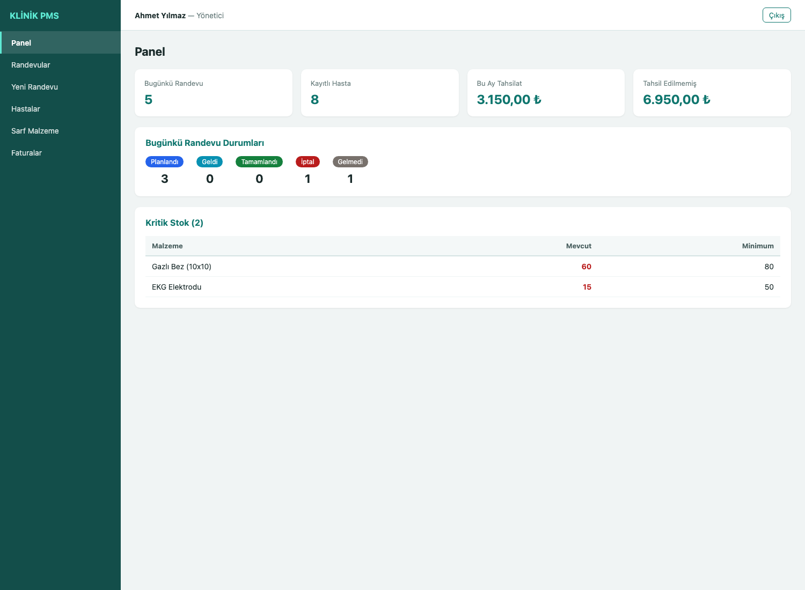 | 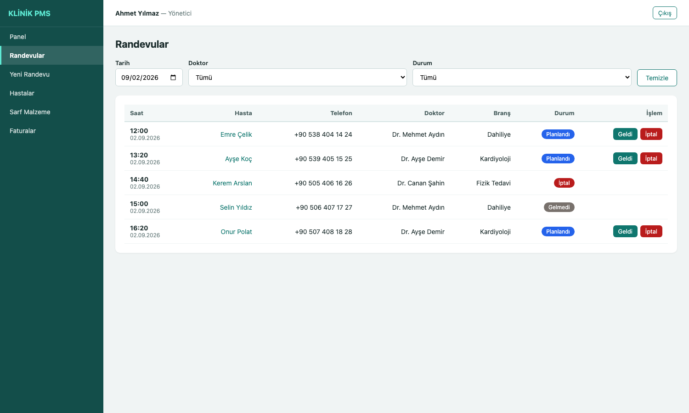 |

| Yeni Randevu (slot seçimi) | Hasta Detayı |
|----------------------------|--------------|
| 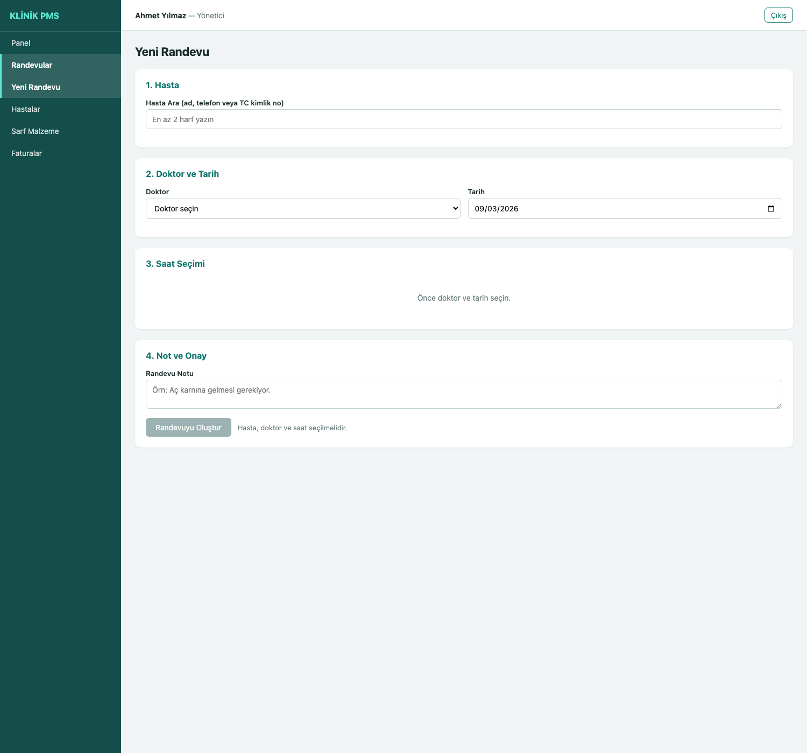 | 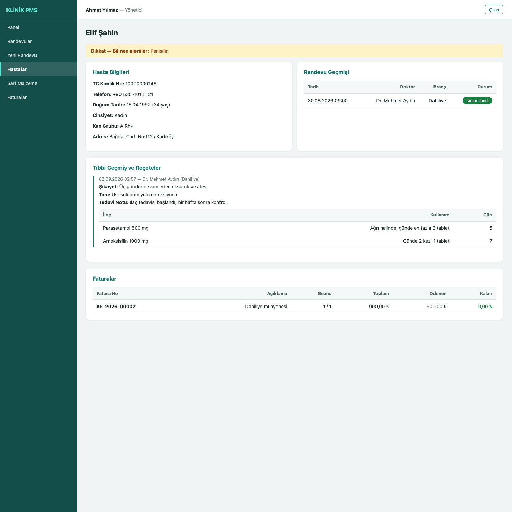 |

| Sarf Malzeme | Fatura (çok seanslı) |
|--------------|----------------------|
| 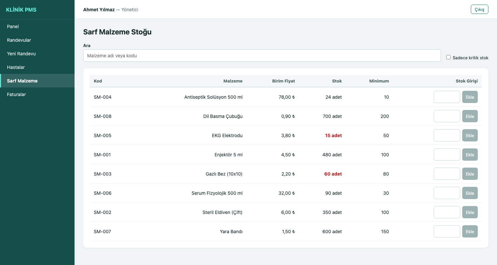 | 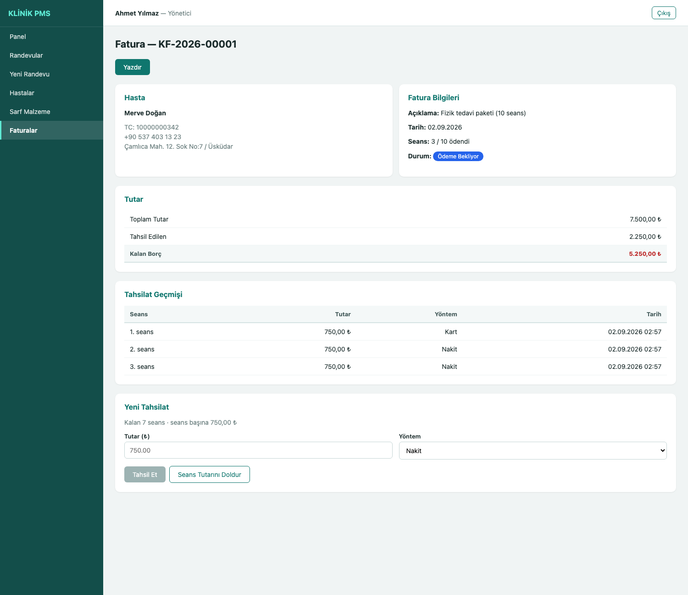 |

### Resepsiyon Masaüstü Uygulaması

| Giriş | Bugünkü Randevular ve Check-in |
|-------|-------------------------------|
| 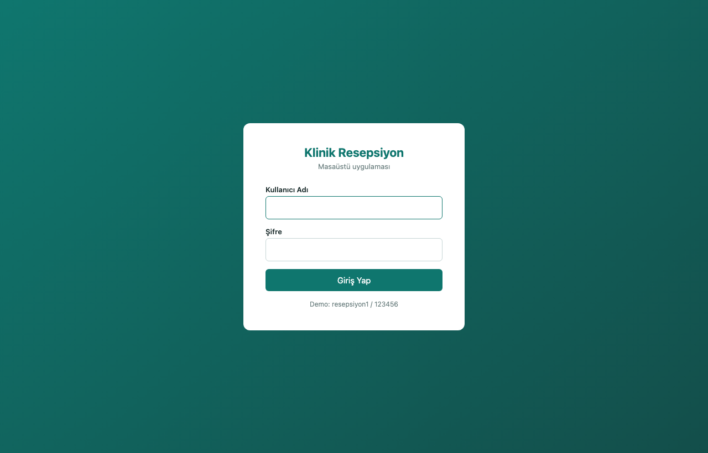 | 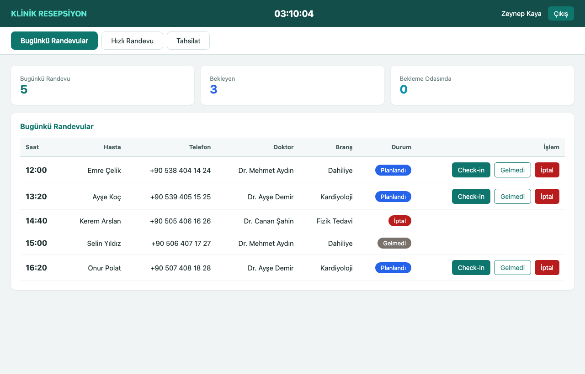 |

### Hasta Mobil Uygulaması

| Giriş (TC + telefon) | Randevularım | Ödemelerim |
|----------------------|--------------|------------|
| 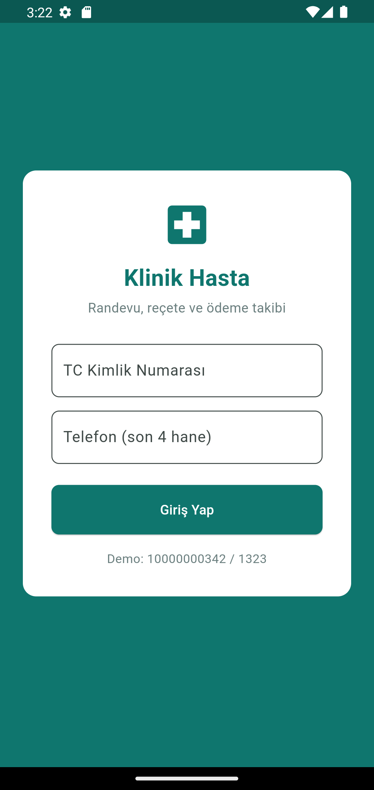 | 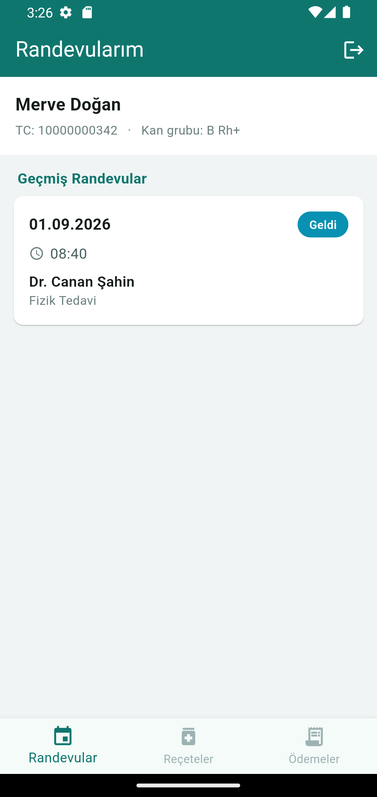 | 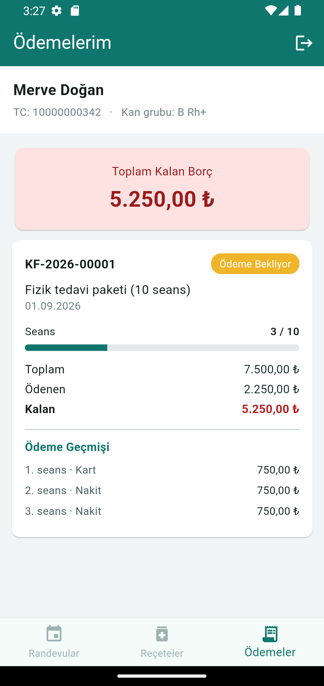 |

---

## Demo Hesapları

| Kullanıcı Adı | Şifre | Rol |
|---------------|-------|-----|
| `admin` | `123456` | Yönetici |
| `resepsiyon1` | `123456` | Resepsiyon |
| `dr.aydin` | `123456` | Doktor (Dahiliye) |
| `dr.demir` | `123456` | Doktor (Kardiyoloji) |
| `dr.sahin` | `123456` | Doktor (Fizik Tedavi) |

**Hasta girişi (mobil):** `10000000342` / `1323` (Merve Doğan)

---

## Veritabanı Tabloları

| Tablo | Açıklama |
|-------|----------|
| `users` | Personel: admin, resepsiyon, doktor |
| `patients` | Hastalar (TC kimlik no benzersiz) |
| `doctors` | Doktorlar (branş, muayene ücreti) |
| `appointments` | Randevular |
| `medical_records` | Muayene kayıtları |
| `prescriptions` | Reçete kalemleri |
| `supplies` | Sarf malzeme stoğu |
| `supply_usages` | Muayenede kullanılan malzemeler |
| `invoices` | Faturalar (çok seanslı) |
| `payments` | Seans bazlı tahsilatlar |

---

## API Uçları

### Personel

| Metot | Yol | Açıklama |
|-------|-----|----------|
| POST | `/api/auth/login` | Personel girişi |
| GET | `/api/patients?q=` | Hasta arama |
| GET | `/api/patients/:id` | Hasta detayı + randevu geçmişi |
| POST/PUT | `/api/patients` | Hasta ekleme / güncelleme |
| GET | `/api/doctors` | Doktor listesi |
| GET | `/api/doctors/:id/slots?date=` | Boş randevu saatleri |
| GET | `/api/appointments?date=&doctorId=&status=` | Randevu listesi |
| POST | `/api/appointments` | Yeni randevu (çakışma kontrolü) |
| PUT | `/api/appointments/:id/status` | Durum güncelleme (check-in) |
| GET | `/api/records?patientId=` | Hastanın muayene kayıtları |
| POST | `/api/records` | Muayene + reçete kaydı |
| POST | `/api/records/:id/supplies` | Malzeme kullanımı (stok düşer) |
| GET | `/api/supplies?q=&lowStock=1` | Sarf malzeme listesi |
| PUT | `/api/supplies/:id/stock-in` | Depoya mal girişi (yönetici) |
| GET | `/api/invoices?patientId=&unpaid=1` | Fatura listesi |
| POST | `/api/invoices` | Fatura kesme |
| POST | `/api/invoices/:id/payments` | Seans/taksit tahsilatı |
| GET | `/api/reports/summary` | Panel özeti |
| GET | `/api/reports/daily?date=` | Gün sonu kasa raporu |

### Hasta portalı (mobil uygulama)

| Metot | Yol | Açıklama |
|-------|-----|----------|
| POST | `/api/patient-portal/login` | TC kimlik no + telefon ile giriş |
| GET | `/api/patient-portal/appointments` | Kendi randevuları |
| GET | `/api/patient-portal/records` | Kendi muayene kayıtları ve reçeteleri |
| GET | `/api/patient-portal/invoices` | Kendi faturaları ve ödemeleri |

> Hasta portalı uçları yalnızca `hasta` rolündeki token ile çalışır; personel
> token'ı ile erişilemez. Her hasta yalnızca kendi kayıtlarını görür.
