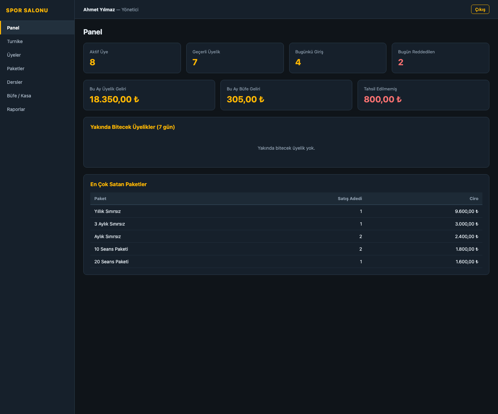
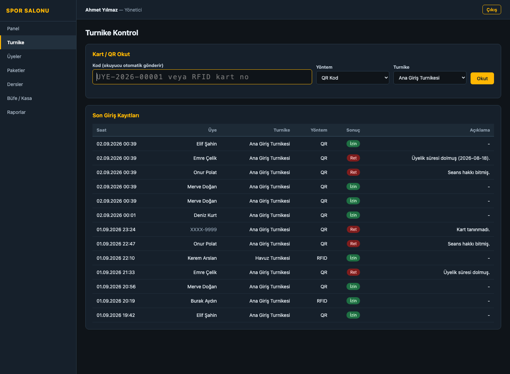
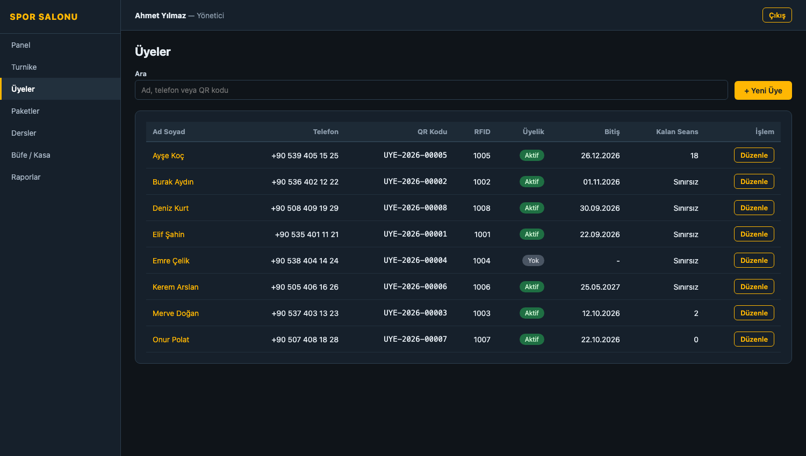
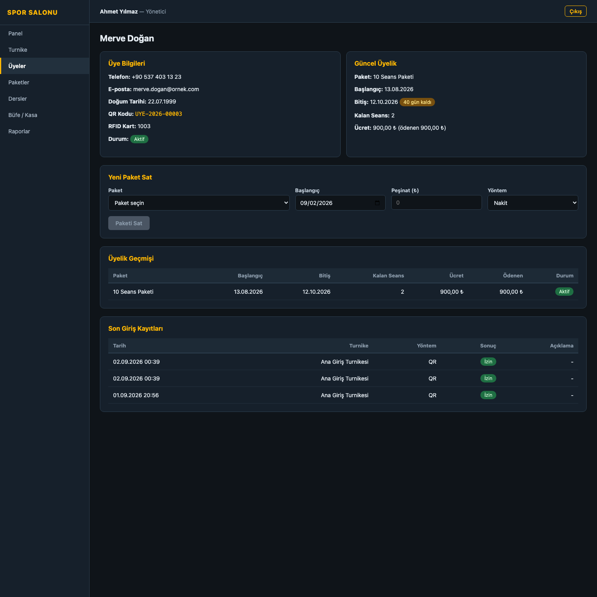
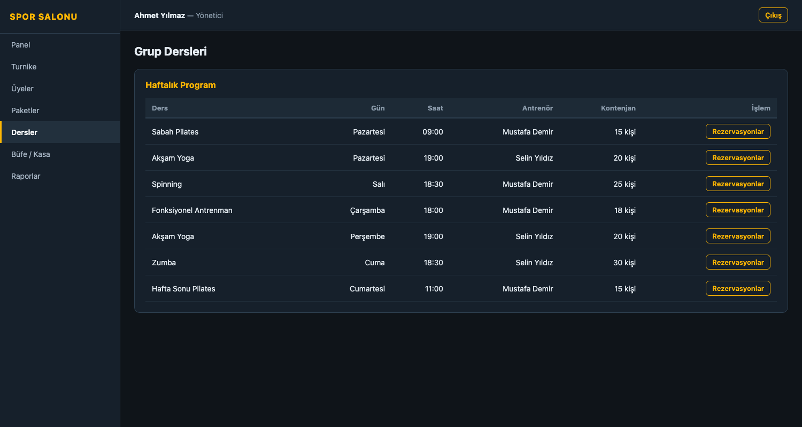
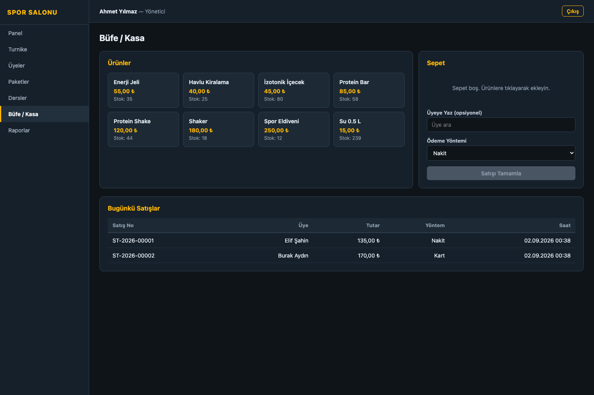
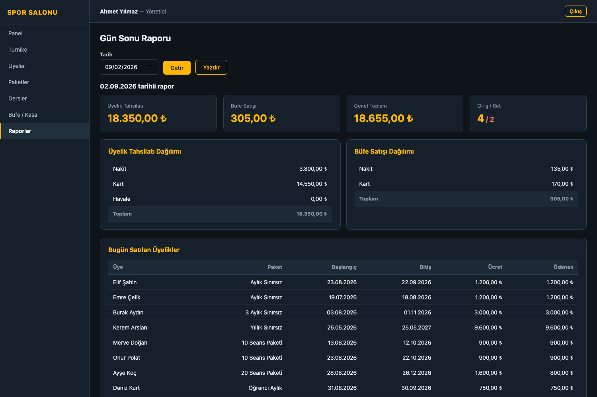
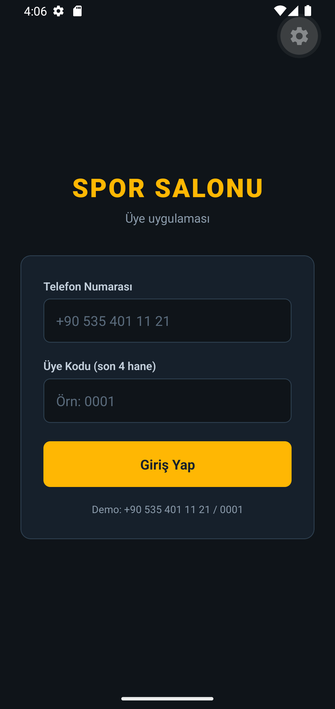
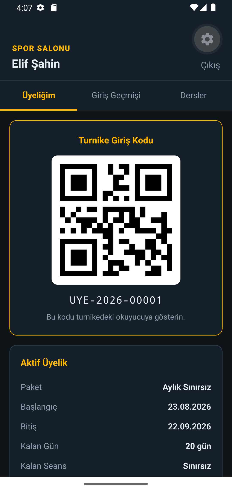
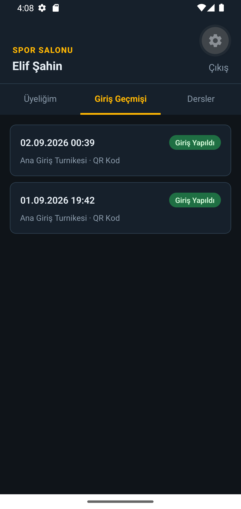

# Spor Salonu & Turnike Otomasyonu

Bir spor salonunun üyelik, giriş kontrolü ve kasa işlemlerini yöneten dört
uygulamalık sistem: QR/RFID turnike geçişi, üyelik paketi satışı ve taksitli
tahsilat, grup dersi rezervasyonu, büfe satışı ve gün sonu kasa raporu.

> Kurulum ve çalıştırma adımları için **[KURULUM.md](KURULUM.md)** dosyasına bakın.

---

## Sistem Mimarisi

```
                        ┌─────────────────────────┐
                        │   MySQL 8 (Docker)      │
                        │   gym_db                │
                        └───────────▲─────────────┘
                                    │
                        ┌───────────┴─────────────┐
                        │   API (Express + MySQL) │
                        │   localhost:3104        │
                        └──▲──────────▲─────────▲──┘
                           │          │         │
            ┌──────────────┘          │         └──────────────┐
            │                         │                        │
 ┌──────────┴─────────┐   ┌───────────┴──────────┐  ┌──────────┴────────┐
 │  Yönetim Paneli    │   │  Kasa (WinForms)     │  │  Üye Mobil        │
 │  React + Vite      │   │  Windows             │  │  React Native     │
 │  localhost:5104    │   │  Turnike donanımı    │  │  QR kodu gösterir │
 │  Turnike simülasyon│   │  (seri port)         │  │  Android          │
 └────────────────────┘   └──────────────────────┘  └───────────────────┘
```

---

## Kullanılan Teknolojiler

| Uygulama | Teknoloji | Klasör |
|----------|-----------|--------|
| API | Node.js 22, Express 5, MySQL 8, JWT, BCrypt | `apps/api` |
| Yönetim Paneli | React 19, Vite, React Router | `apps/web-admin` |
| Kasa Uygulaması | C# WinForms (net9.0-windows), System.IO.Ports | `apps/desktop-winforms` |
| Üye Mobil | React Native, Expo, react-native-qrcode-svg | `apps/mobile` |

---

## Turnike Geçiş Mantığı

Sistemin kalbi `POST /api/checkins/scan` ucudur. Bir QR kodu veya RFID kartı
okutulduğunda sırayla şunlar kontrol edilir:

```
Kart okutuldu
   │
   ├─ Kart tanınmıyor mu?              → RET: "Kart tanınmadı."
   ├─ Üyelik dondurulmuş mu?           → RET: "Üyelik dondurulmuş."
   ├─ Hiç üyelik kaydı yok mu?         → RET: "Üyelik kaydı bulunamadı."
   ├─ Üyelik süresi dolmuş mu?         → RET: "Üyelik süresi dolmuş (18.08.2026)."
   ├─ Üyelik henüz başlamadı mı?       → RET: "Üyelik 05.09.2026 tarihinde başlıyor."
   ├─ Seans hakkı bitmiş mi?           → RET: "Seans hakkı bitmiş."
   └─ Hepsi geçerli                    → İZİN + kapı açma komutu
```

**Önemli iş kuralları:**

- **Her ret sebebiyle birlikte kaydedilir.** Tanınmayan kartlar bile `checkins`
  tablosuna yazılır; böylece denetim izi oluşur.
- **Aynı gün ikinci girişte seans düşülmez.** Üye öğlen çıkıp akşam geri gelirse
  seans hakkı iki kez tüketilmez.
- **Süresi dolan üyelik otomatik kapatılır** (`status = 'bitti'`).
- Sınırsız paketlerde `remaining_sessions` alanı `NULL`'dur; seans düşümü yapılmaz.

---

## Turnike Donanımı (WinForms)

Kasa uygulaması gerçek turnike kontrol kartıyla **seri port** üzerinden haberleşir
(`TurnikeDonanimi.cs`):

- Kart okuyucu okuduğu kodu porta yazar → uygulama otomatik sorgular
- Giriş izni verilirse porta `OPEN` komutu gönderilir (kapı açılır)
- Reddedilirse `DENY` komutu gönderilir (kırmızı ışık / sesli uyarı)
- **Donanım bağlı değilse otomatik olarak simülasyon moduna düşer** — okul
  sunumunda ve geliştirme sırasında donanım gerekmez
- Gönderilen her komut ekrandaki günlükte gösterilir

---

## Özellikler

**Üyelik yönetimi**
- Üye kaydında QR kodu otomatik üretilir (`UYE-2026-00001`), RFID kartı atanabilir
- Paket satışı: süre + seans sayısı + fiyat, peşinat alma
- Taksitli tahsilat; kalan borçtan fazla ödeme engellenir
- Bitişe 7 gün kalan üyelikler panelde uyarı olarak listelenir

**Turnike ve giriş kontrolü**
- Web panelinde simülasyon ekranı, WinForms'ta gerçek donanım desteği
- Canlı giriş kaydı tablosu (izin/ret, sebep, turnike, yöntem)
- Üye kendi giriş geçmişini mobil uygulamadan görür

**Grup dersleri**
- Haftalık program, antrenör ataması, kapasite
- Rezervasyonda kapasite ve geçerli üyelik kontrolü
- Aynı üye aynı derse iki kez kaydedilemez

**Büfe / kasa**
- Ürün ızgarası, sepet, nakit/kart satış
- Satışta stok düşer; stok yetersizse işlem transaction ile geri alınır
- Satış üyeye ilişkilendirilebilir

**Raporlama**
- Gün sonu kasa raporu: üyelik ve büfe tahsilatının yöntem dağılımı
- Bugünkü giriş / ret sayıları
- En çok satan paketler, tahsil edilmemiş toplam
- WinForms'tan A4 yazdırma (imza satırlı)

---

## Ekran Görüntüleri

### Yönetim Paneli

| Panel | Turnike Kontrol |
|-------|-----------------|
|  |  |

| Üyeler | Üye Detayı |
|--------|------------|
|  |  |

| Grup Dersleri | Büfe / Kasa |
|---------------|-------------|
|  |  |

| Gün Sonu Raporu |
|-----------------|
|  |

### Üye Mobil Uygulaması

| Giriş | Turnike QR Kodu | Giriş Geçmişi |
|-------|-----------------|---------------|
|  |  |  |

---

## Demo Hesapları

| Kullanıcı Adı | Şifre | Rol |
|---------------|-------|-----|
| `admin` | `123456` | Yönetici |
| `kasiyer1` | `123456` | Kasiyer |
| `antrenor1` | `123456` | Antrenör |

**Üye girişi (mobil):** `+90 535 401 11 21` / `0001` (Elif Şahin)

---

## Veritabanı Tabloları

| Tablo | Açıklama |
|-------|----------|
| `users` | Personel: admin, kasiyer, antrenor |
| `members` | Üyeler (QR kodu ve RFID kartı benzersiz) |
| `packages` | Üyelik paketleri (süre + seans + fiyat) |
| `memberships` | Satılan üyelikler, kalan seans, ödenen tutar |
| `payments` | Üyelik tahsilatları |
| `gates` | Turnike cihazları |
| `checkins` | Giriş kayıtları (izin/ret + sebep) |
| `classes` | Grup dersleri (haftalık program) |
| `class_bookings` | Ders rezervasyonları |
| `products` | Büfe ürünleri |
| `sales` / `sale_items` | Büfe satışları |

---

## API Uçları

### Personel

| Metot | Yol | Açıklama |
|-------|-----|----------|
| POST | `/api/auth/login` | Personel girişi |
| POST | `/api/checkins/scan` | **Turnike okutma** (QR / RFID) |
| GET | `/api/checkins?date=&result=` | Giriş kayıtları |
| GET | `/api/checkins/gates` | Turnike cihazları |
| GET | `/api/members?q=` | Üye arama (ad, telefon, QR) |
| GET | `/api/members/:id` | Üye detayı + üyelik ve giriş geçmişi |
| POST/PUT | `/api/members` | Üye ekleme / güncelleme |
| POST | `/api/members/:id/memberships` | Paket satışı |
| POST | `/api/members/memberships/:id/payments` | Üyelik tahsilatı |
| GET/POST/PUT | `/api/packages` | Paket yönetimi |
| GET | `/api/classes` | Haftalık ders programı |
| POST | `/api/classes/:id/bookings` | Ders rezervasyonu |
| DELETE | `/api/classes/bookings/:id` | Rezervasyon iptali |
| GET/POST | `/api/pos/products` | Büfe ürünleri |
| POST | `/api/pos/sales` | Büfe satışı (stok düşer) |
| GET | `/api/reports/summary` | Panel özeti |
| GET | `/api/reports/daily?date=` | Gün sonu kasa raporu |

### Üye portalı (mobil uygulama)

| Metot | Yol | Açıklama |
|-------|-----|----------|
| POST | `/api/auth/member-login` | Telefon + üye kodu ile giriş |
| GET | `/api/member-portal/me` | Üyelik durumu ve QR kodu |
| GET | `/api/member-portal/checkins` | Kendi giriş geçmişi |
| GET | `/api/member-portal/classes` | Ders programı ve rezervasyonları |

> Üye portalı uçları yalnızca `uye` rolündeki token ile çalışır.
