# Araç Üstü Satış & Depo Yönetimi

Toptan gıda dağıtımı yapan bir firma için **saha satış (van sales)** sistemi.
Satış temsilcileri ürünleri araçlarına yükleyip mahalle mahalle dolaşır,
bakkallara satış yapar ve tahsilat toplar. Merkez depo ise stoğu, araçları
ve günün cirosunu masaüstü uygulamadan takip eder.

Projenin can alıcı noktası: **saha uygulaması internet olmadan çalışır.**
Fatura önce telefona kaydedilir, bağlantı gelince sunucuya gönderilir.

---

## Sistem Mimarisi

```
                       ┌──────────────────────────┐
                       │   SQL Server 2022        │
                       │   (Docker, port 1434)    │
                       └────────────┬─────────────┘
                                    │
                       ┌────────────┴─────────────┐
                       │  ASP.NET Core 9 Web API  │
                       │  JWT + EF Core 9         │
                       │  http://localhost:5105   │
                       └──────┬────────────┬──────┘
                              │            │
              ┌───────────────┘            └───────────────┐
              │                                            │
  ┌───────────┴────────────┐                  ┌────────────┴───────────┐
  │  Depo Yönetimi         │                  │  Saha Satış            │
  │  WinForms (.NET 9)     │                  │  Flutter (Android)     │
  │  Windows masaüstü      │                  │  SQLite ile çevrimdışı │
  └────────────────────────┘                  └────────────────────────┘
```

---

## Kullanılan Teknolojiler

| Katman | Teknoloji |
|--------|-----------|
| Veritabanı | SQL Server 2022 (Docker) |
| API | ASP.NET Core 9, Entity Framework Core 9, JWT, BCrypt |
| Masaüstü | C# WinForms (.NET 9), tasarımcıda düzenlenebilir formlar |
| Mobil | Flutter 3.24.5 / Dart 3.5.4, sqflite, geolocator, connectivity_plus |

---

## Çevrimdışı Çalışma Mantığı

Saha temsilcisi bodrum katta, kapalı bir pasajda ya da şehir dışında olabilir.
İnternet yoksa satışın durmaması gerekir. Çözüm şu şekilde kurgulandı:

**1. Katalog indirme.** Giriş yapıldığında `GET /api/sync/pull` çağrılır;
ürünler, müşteriler, araçtaki stok ve açık faturalar telefonun SQLite
veritabanına yazılır. Bu andan sonra uygulama tamamen çevrimdışı çalışabilir.

**2. Yerel kayıt.** Kesilen her fatura önce SQLite'a yazılır
(`senkron_durumu = 'bekliyor'`). Araç stoğu da yerelde düşülür ki temsilci
elindeki gerçek stoğu görsün.

**3. Cihazda üretilen kimlik.** Her faturaya cihazda benzersiz bir
`offline_id` verilir:

```dart
final offlineId = 'van$aracId-${DateTime.now().millisecondsSinceEpoch}';
```

**4. Gönderim.** `POST /api/sync/push` bekleyen tüm kayıtları tek seferde
gönderir. Sunucu her kayıt için şu cevabı döner:

| Durum | Anlamı |
|-------|--------|
| `kaydedildi` | Yeni kayıt açıldı, fatura numarası verildi |
| `zaten_var` | Bu `offline_id` daha önce gelmiş, yeni kayıt açılmadı |
| `hata` | Kayıt alınamadı, mesajı gösterilir |

Uygulama `kaydedildi` ile `zaten_var` durumlarını **aynı şekilde** ele alır —
ikisi de sunucunun kaydı aldığı anlamına gelir:

```dart
if (durum == 'kaydedildi' || durum == 'zaten_var') {
  await YerelDb.faturaGonderildi(s['offlineId'], s['invoiceNo']);
}
```

Bu sayede bağlantı gönderim sırasında koparsa ve kullanıcı tekrar denerse
**mükerrer fatura oluşmaz.** Sunucu tarafında `OfflineId` alanında
benzersiz indeks (unique index) vardır, yani veritabanı da bunu garanti eder.

**5. GPS.** Uygulama açıkken her 2 dakikada bir konum kaydedilir; bu kayıtlar
da çevrimdışı birikir ve senkronizasyonda gönderilir. Depo uygulaması
"Araçlar / Rota" ekranında aracın gün içindeki rotasını ve fatura kestiği
durakları görebilir.

---

## Özellikler

### Saha Mobil Uygulaması (Flutter)

- Giriş yapınca ürün/müşteri/stok listesini indirir, sonrası çevrimdışı
- Üstte sabit **senkronizasyon şeridi**: çevrimiçi/çevrimdışı durumu,
  bekleyen kayıt sayısı, araç plakası, "Senkronize Et" düğmesi
- **Yeni Satış**: müşteri seçimi (arama ile), ürün seçimi (araçta olmayan
  ürünler seçilemez), miktar kontrolü, KDV'li toplam hesabı, nakit/vadeli
- **Faturalarım**: cihazdaki faturalar; bekleyen/gönderilen filtreleri,
  detay ekranı (kalemler, toplamlar, konum)
- **Tahsilat**: vadeli faturaların kalan borcu, ödeme oranı çubuğu,
  tahsilat alma (nakit / kredi kartı / havale)
- **Araç Stoğu**: araçtaki güncel miktarlar; azalan ürünler turuncu,
  tükenenler kırmızı
- Çıkışta gönderilmemiş kayıt varsa uyarı verir

### Depo Yönetimi (WinForms)

- **Genel Durum**: bugünkü fatura sayısı ve ciro, aylık ciro, açık bakiye,
  kritik stok sayısı, araç bazında günün performansı, en çok satan ürünler
- **Depo Stoğu**: ürün arama, kritik stok filtresi, depoya mal girişi,
  yeni ürün ekleme (sadece yönetici)
- **Araca Yükleme**: soldan ürün seçip sağa aktarma; depo stoğundan fazlası
  yüklenemez, kaydedince yükleme fişi (`YK-2026-00001`) oluşur
- **Araçlar / Rota**: araç listesi, araç üstü stok, son GPS konumu,
  seçilen günün rotası ve durakları
- **Faturalar**: ödeme tipi / tarih / ödenmemiş filtreleri, fatura detayı
  (kalemler, tahsilatlar, kesim konumu, cihaz kimliği)
- **Gün Sonu Raporu**: nakit/vadeli ayrımı, günün cirosu, sahadan gelen tahsilat

---

## Ekran Görüntüleri

### Saha Mobil Uygulaması

| | |
|---|---|
| 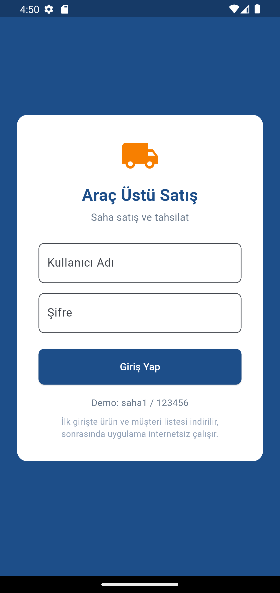 | 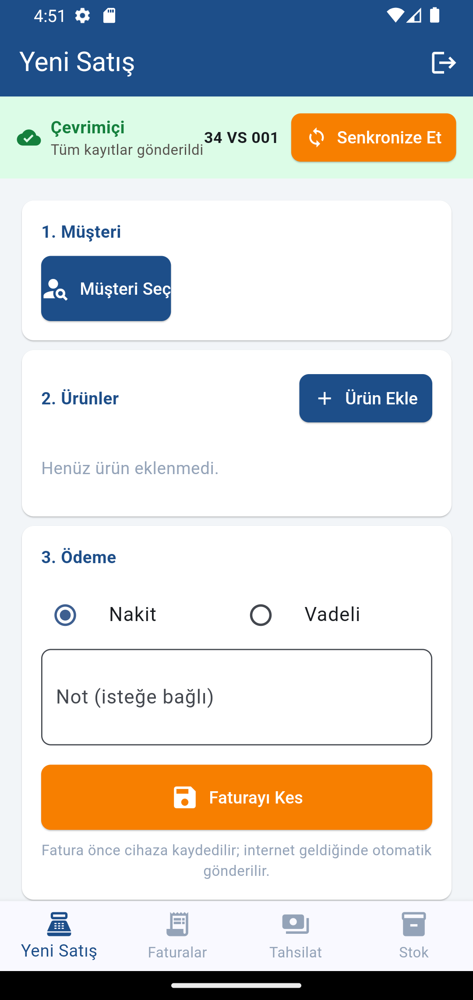 |
| Giriş — ilk açılışta katalog iner | Yeni satış ekranı ve senkron şeridi |
| 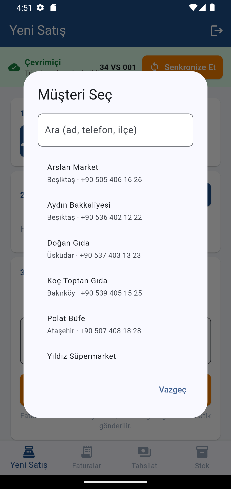 | 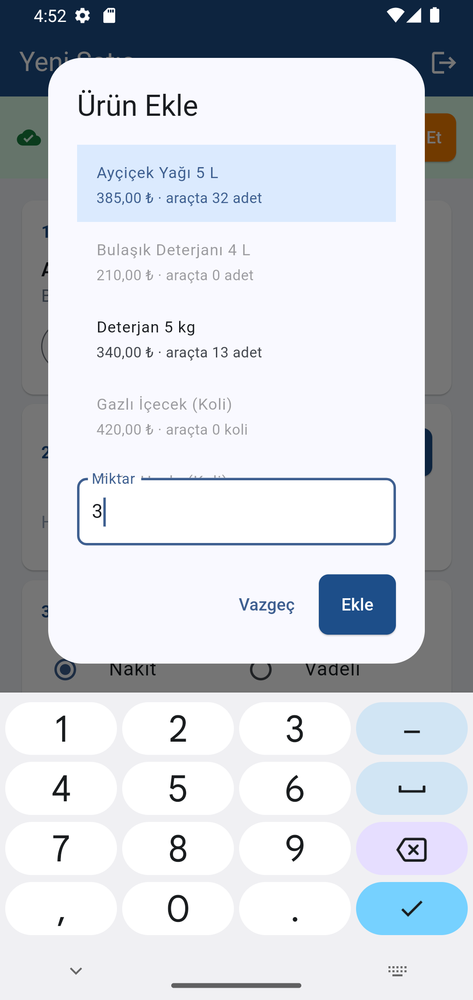 |
| Müşteri seçimi (yerel arama) | Ürün seçimi — araçta olmayan ürün seçilemez |
| 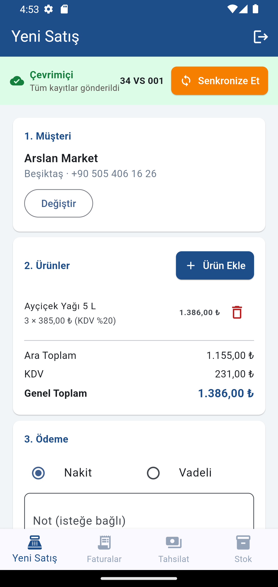 | 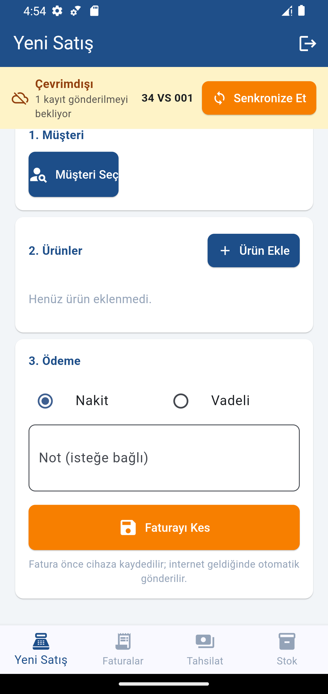 |
| KDV'li toplam hesabı | İnternet yokken kesilen fatura cihaza yazıldı |
| 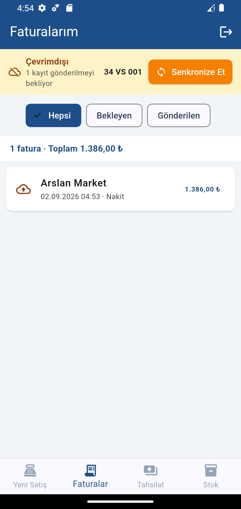 | 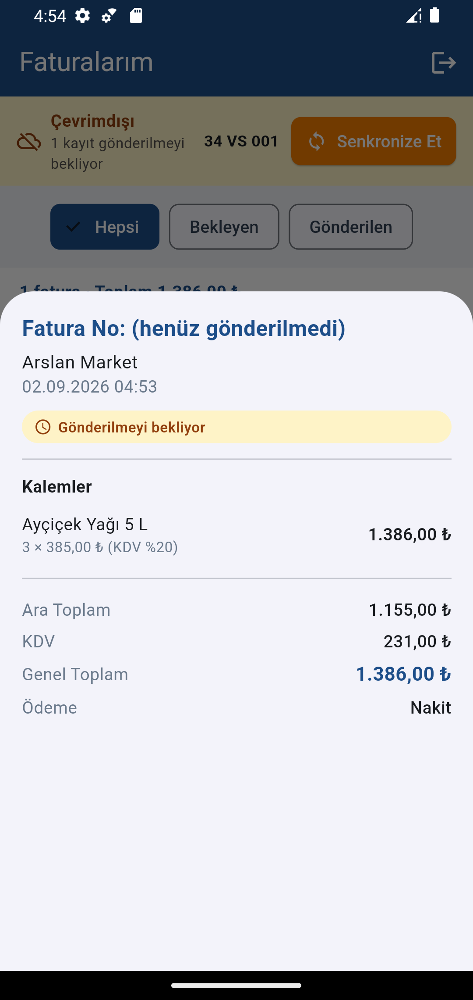 |
| Gönderilmeyi bekleyen fatura | Fatura detayı — henüz numara yok |
| 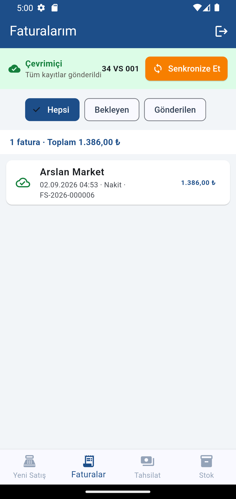 | 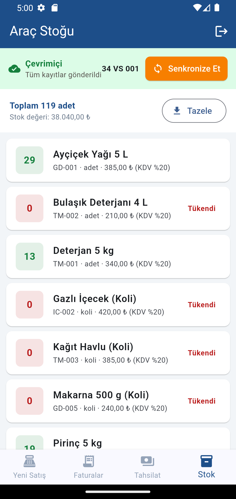 |
| Senkronizasyondan sonra numara geldi | Araç stoğu — satılan düşüldü (32 → 29) |
| 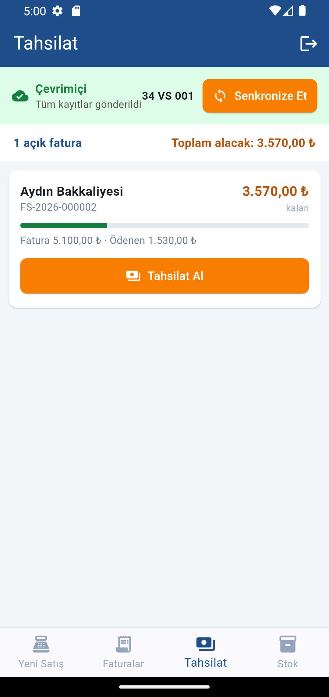 | 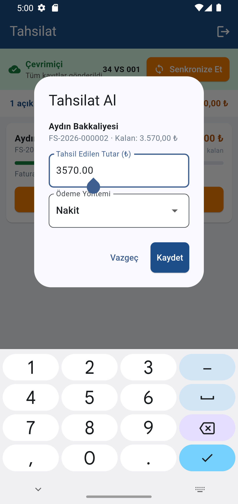 |
| Açık faturalar ve kalan borç | Tahsilat alma |
| 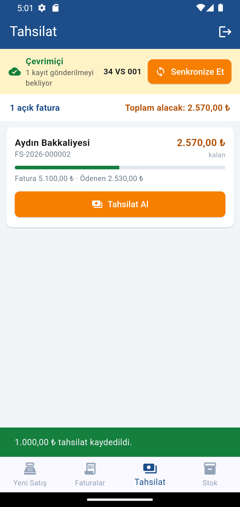 | |
| Tahsilat cihaza kaydedildi | |

---

## Demo Hesapları

Şifre: **123456**

| Kullanıcı | Rol | Uygulama |
|-----------|-----|----------|
| `admin` | Yönetici | Depo (Windows) |
| `depo1` | Depo sorumlusu | Depo (Windows) |
| `saha1` | Satış temsilcisi — 34 VS 001 | Mobil |
| `saha2` | Satış temsilcisi — 34 VS 002 | Mobil |

---

## Veritabanı Tabloları

| Tablo | İçerik |
|-------|--------|
| `Users` | Personel: admin, depo, saha |
| `Vans` | Araçlar ve bağlı oldukları satış temsilcisi |
| `Products` | Ürün kataloğu, depo stoğu, kritik stok seviyesi |
| `VanStocks` | Araç üstü stok (araç + ürün) |
| `LoadOrders` / `LoadOrderItems` | Depodan araca yükleme fişleri |
| `Customers` | Bakkal / market müşterileri, vade limiti |
| `Invoices` / `InvoiceItems` | Faturalar — `OfflineId` benzersiz indeksli |
| `Collections` | Tahsilatlar — `OfflineId` benzersiz indeksli |
| `VanLocations` | GPS konum kayıtları |

---

## API Uçları

### Kimlik

| Metot | Uç | Açıklama |
|-------|-----|----------|
| POST | `/api/auth/login` | Giriş, JWT döner (`van_id` claim'i ile) |
| GET | `/api/auth/me` | Token sahibinin bilgileri |

### Senkronizasyon (mobil)

| Metot | Uç | Açıklama |
|-------|-----|----------|
| GET | `/api/sync/pull` | Ürün, müşteri, araç stoğu, açık faturalar |
| POST | `/api/sync/push` | Bekleyen fatura / tahsilat / konum kayıtları |

### Depo

| Metot | Uç | Açıklama |
|-------|-----|----------|
| GET | `/api/warehouse/products` | Depo stoğu (`q`, `lowStock` filtreleri) |
| POST | `/api/warehouse/products` | Yeni ürün (sadece admin) |
| POST | `/api/warehouse/products/{id}/stock-in` | Depoya mal girişi |
| GET | `/api/warehouse/vans` | Araçlar, araç üstü stok, son konum |
| POST | `/api/warehouse/load-orders` | Depodan araca yükleme |
| GET | `/api/warehouse/load-orders` | Son 50 yükleme fişi |

### Fatura ve rapor

| Metot | Uç | Açıklama |
|-------|-----|----------|
| GET | `/api/invoices` | Fatura listesi (`paymentType`, `vanId`, `date`, `unpaid`) |
| GET | `/api/invoices/{id}` | Fatura detayı, kalemler, tahsilatlar |
| GET | `/api/customers` | Müşteriler ve güncel borçları |
| GET | `/api/reports/summary` | Panel özeti |
| GET | `/api/reports/van-route` | Bir aracın gün içindeki rotası |
| GET | `/api/reports/daily` | Gün sonu raporu |

---

## Kurulum

Adım adım kurulum için **[KURULUM.md](KURULUM.md)** dosyasına bakın.
