# Apart & Otel Rezervasyon Yönetimi

İki tesisi (bir apart binası ve bir butik otel) tek panelden yöneten
rezervasyon ve görev takip sistemi. Ön büro odaları **sürükle-bırak takvim**
üzerinden yönetir; misafir çıkış yaptığında sistem **otomatik olarak temizlik
görevi açar** ve temizlik ekibi işi telefonundan kapatınca oda tekrar satışa
açılır.

---

## Sistem Mimarisi

```
                    ┌──────────────────────────┐
                    │   MongoDB 7 (Docker)     │
                    │   pms_rentals  :27018    │
                    └────────────┬─────────────┘
                                 │  Mongoose
                    ┌────────────┴─────────────┐
                    │   Express 5 REST API     │
                    │   JWT + bcrypt           │
                    │   http://localhost:3106  │
                    └──────┬────────────┬──────┘
                           │            │
            ┌──────────────┘            └──────────────┐
            │                                          │
 ┌──────────┴───────────┐                 ┌────────────┴──────────┐
 │  Yönetim Paneli      │                 │  Görev Uygulaması     │
 │  Next.js 16 +        │                 │  React Native (Expo)  │
 │  Tailwind CSS 4      │                 │  Temizlik / teknik    │
 │  :3116               │                 │  ekip                 │
 └──────────────────────┘                 └───────────────────────┘
```

---

## Kullanılan Teknolojiler

| Katman | Teknoloji |
|--------|-----------|
| Veritabanı | MongoDB 7 (Docker), Mongoose |
| API | Node.js + Express 5, JWT, bcryptjs |
| Web | Next.js 16 (App Router), React 19, Tailwind CSS 4 |
| Mobil | React Native / Expo SDK 57, AsyncStorage |

---

## Projenin Özü

### 1. Sürükle-bırak oda takvimi

Takvim, satırları oda / sütunları gün olan bir ızgaradır. Her rezervasyon bir
renkli çubuktur ve **HTML5 sürükle-bırak** ile başka bir odaya veya güne
taşınabilir. Çubuk bırakıldığında `PUT /api/reservations/:id/move` çağrılır.

Sunucu tarafında çakışma kontrolü yapılır. Kural şudur: **giriş günü doludur,
çıkış günü boştur** (o gün başka bir misafir girebilir). Yani çakışma şartı:

```js
{
  room: odaId,
  status: { $ne: 'iptal' },
  checkIn:  { $lt: yeniCikis },
  checkOut: { $gt: yeniGiris },
}
```

Çakışma varsa taşıma reddedilir ve kullanıcıya hangi rezervasyonla çakıştığı
Türkçe olarak söylenir.

### 2. Çıkışta otomatik temizlik görevi

`POST /api/reservations/:id/check-out` çağrıldığında sırayla:

1. Ödenmemiş bakiye varsa çıkış **engellenir** (`Ödenmemiş 5.920,00 ₺ bakiye var.`)
2. Rezervasyon `cikis_yapildi` olur
3. Odanın durumu `temizlik` olur — oda satışa kapanır
4. `source: 'cikis'` işaretli bir **temizlik görevi otomatik açılır**

Temizlik personeli mobil uygulamada görevi tamamladığında
`PUT /api/tasks/:id/complete` çalışır ve odada bekleyen başka iş yoksa oda
`musait` durumuna döner. Böylece resepsiyon "oda hazır mı?" diye kimseye
sormak zorunda kalmaz.

### 3. Hesap dökümü (folio)

Her rezervasyona konaklama bedeli otomatik masraf olarak işlenir; üzerine
kahvaltı, minibar, otopark gibi ekstralar eklenebilir. Tahsilatlar ayrı
tutulur, kalan bakiye `masraflar − tahsilatlar` olarak hesaplanır.

---

## Özellikler

### Yönetim Paneli (Next.js)

- **Oda Takvimi** — 14 günlük ızgara, sürükle-bırak taşıma, tesis filtresi,
  hafta ileri/geri, boş güne çift tıklayarak rezervasyon açma
- **Yeni Rezervasyon** — tarih aralığına göre müsait oda arama, dolu odalar
  seçilemez; mevcut misafirden seçme veya yeni misafir kaydı
- **Rezervasyonlar** — durum filtresi, tarayıcıda arama, folio detayı
- **Rezervasyon Detayı** — konaklama bilgileri, misafir kartı, hesap dökümü,
  masraf ekleme, tahsilat alma, check-in / check-out / iptal
- **Odalar** — kata göre gruplanmış kartlar, oda durumu değiştirme
  (bakıma alınca otomatik bakım görevi açılır)
- **Görevler** — bekliyor / devam ediyor / tamamlandı sütunlarından oluşan pano
- **Misafirler** — arama ve konaklama sayısı
- **Raporlar** — doluluk oranı, 14 günlük doluluk grafiği, gün sonu raporu
  (nakit / kredi kartı / havale ayrımı, girişler, çıkışlar, tahsilatlar)

### Görev Uygulaması (React Native)

- Sadece temizlik ve teknik personel giriş yapabilir (yönetici uyarı alır)
- Kendi görevleri + henüz kimseye atanmamış görevler listelenir
- Temizlikçi bakım işlerini, teknisyen temizlik işlerini görmez
- Acil görevler kırmızı çerçeveyle öne çıkar
- Görev detayında **İşe Başla** ve **Görevi Tamamla**; tamamlarken not bırakılır
- Tamamlandığında odanın satışa açılıp açılmadığı ekranda söylenir

---

## Ekran Görüntüleri

### Yönetim Paneli

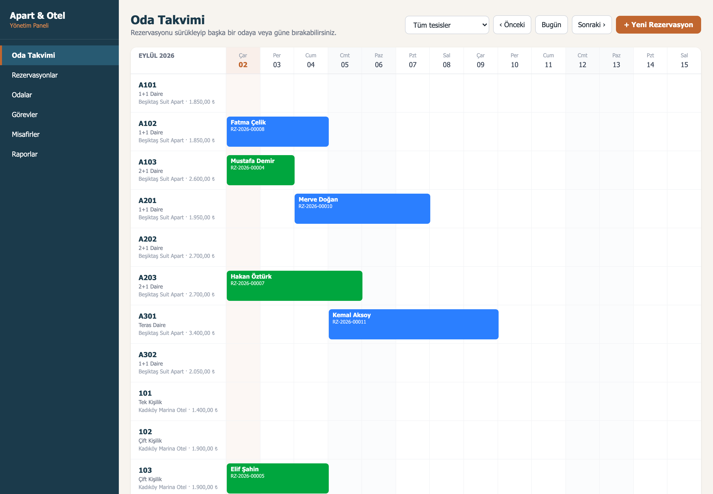
*Oda takvimi — rezervasyonlar sürüklenerek başka odaya/güne taşınabilir*

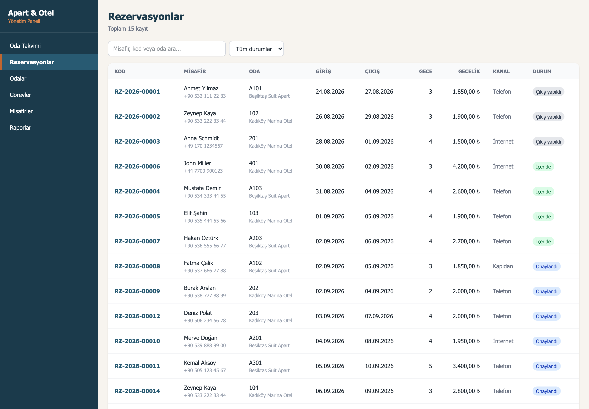
*Rezervasyon listesi*

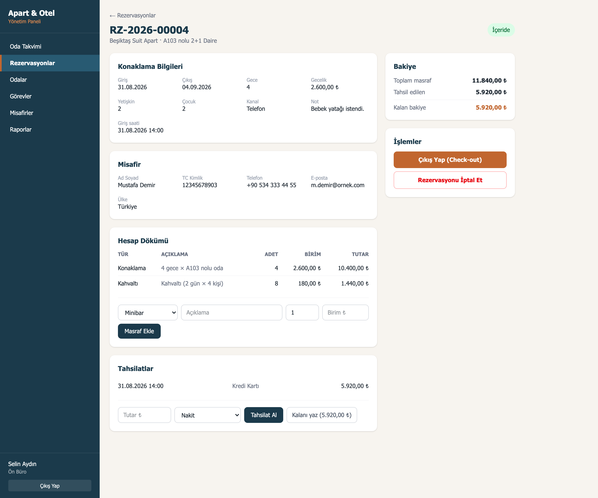
*Hesap dökümü, masraf ekleme ve tahsilat*

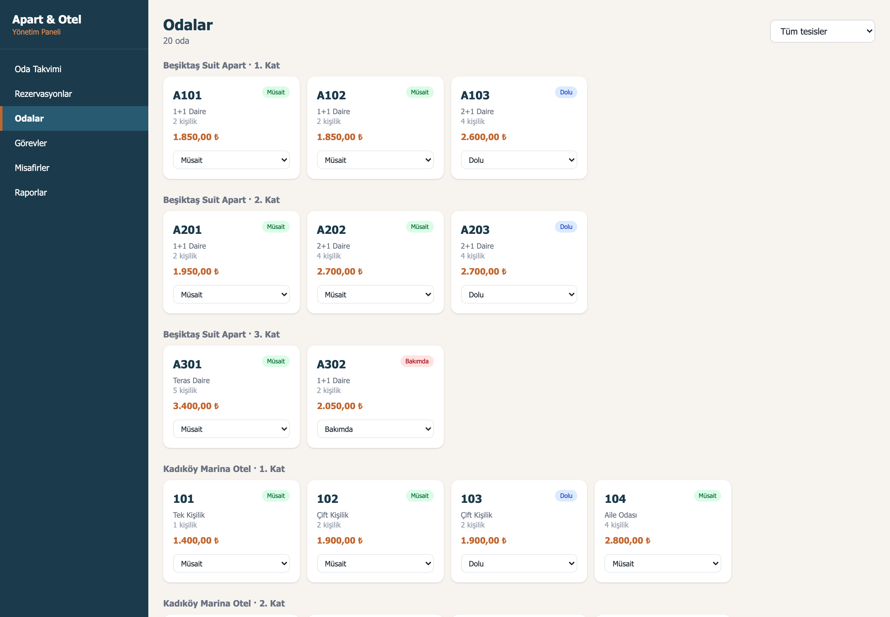
*Odalar — kata göre gruplanmış, durum değiştirilebilir*

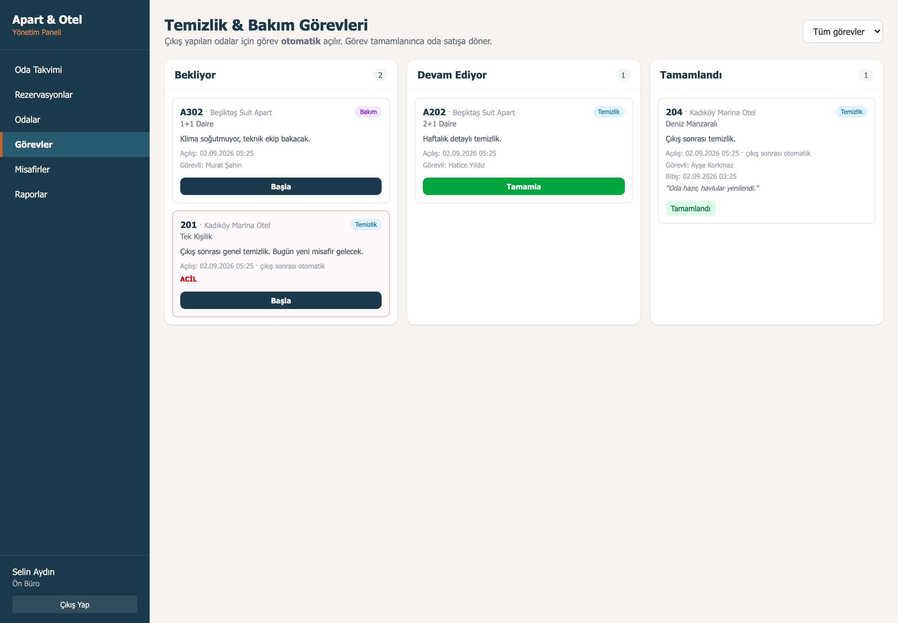
*Görev panosu — 201 nolu odanın görevi çıkış sonrası otomatik açıldı*

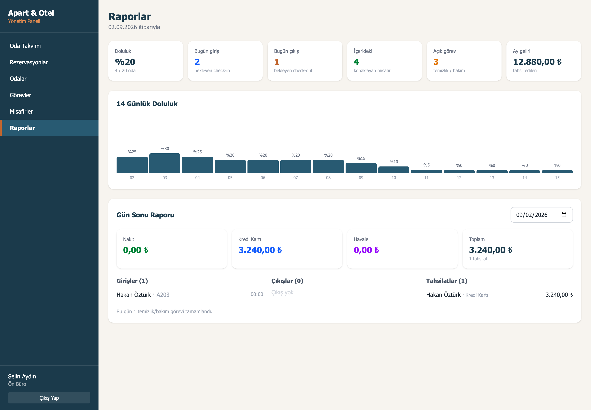
*Doluluk ve gün sonu raporu*

### Görev Uygulaması

| | | |
|---|---|---|
| 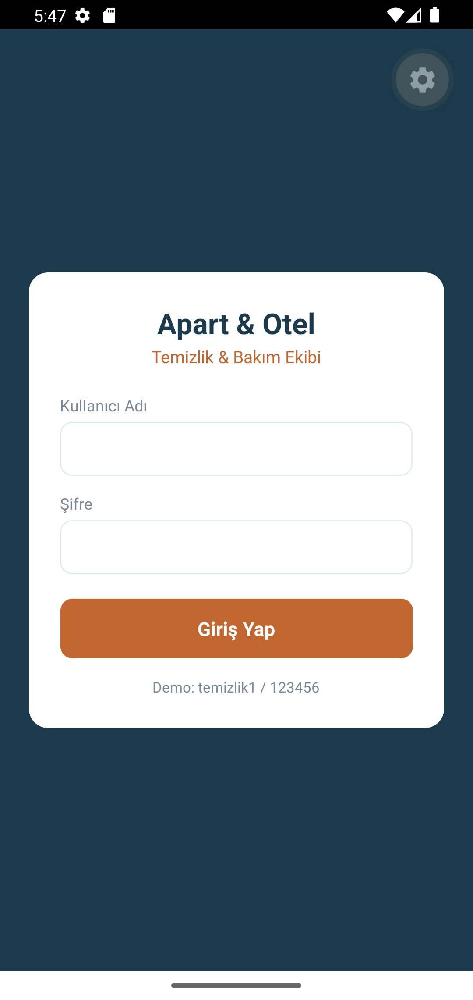 | 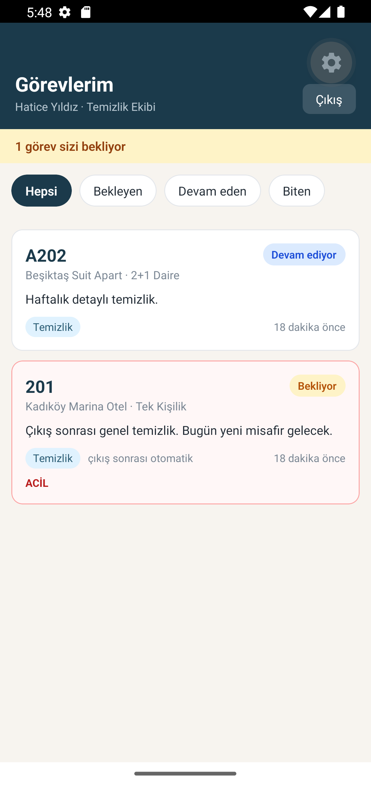 | 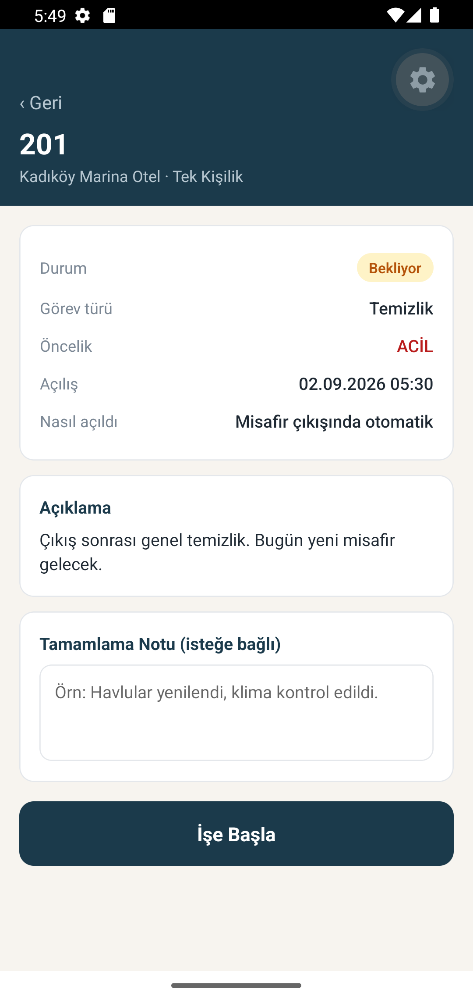 |
| Giriş | Görevlerim | Görev detayı |
| 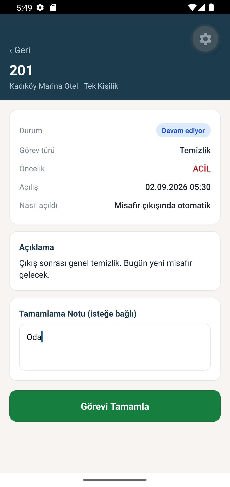 | 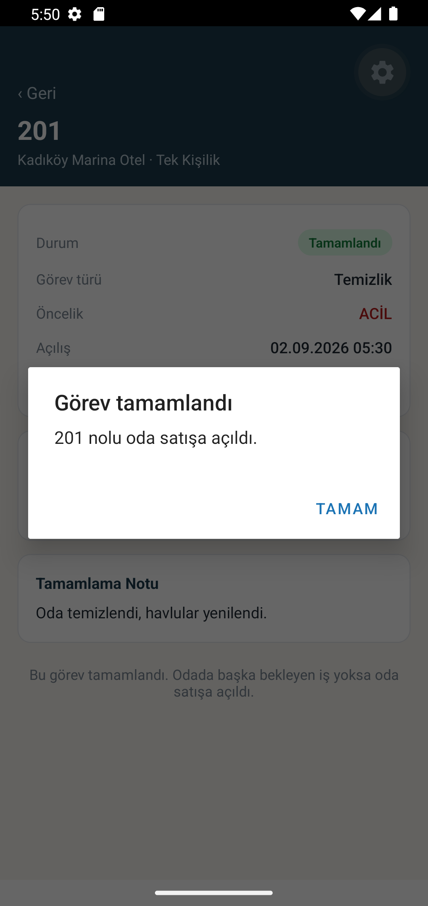 | |
| İşe başlandı | Tamamlanınca oda satışa açıldı | |

---

## Demo Hesapları

Şifre: **123456**

| Kullanıcı | Rol | Uygulama |
|-----------|-----|----------|
| `admin` | Yönetici | Web paneli |
| `resepsiyon` | Ön büro | Web paneli |
| `temizlik1` | Temizlik ekibi | Mobil (ve web görev ekranı) |
| `temizlik2` | Temizlik ekibi | Mobil |
| `teknik1` | Teknik ekip | Mobil |

---

## API Uçları

### Kimlik

| Metot | Uç | Açıklama |
|-------|-----|----------|
| POST | `/api/auth/login` | Giriş, JWT döner |
| GET | `/api/auth/me` | Token sahibinin bilgileri |

### Oda ve tesis

| Metot | Uç | Açıklama |
|-------|-----|----------|
| GET | `/api/rooms/properties` | Tesis listesi |
| GET | `/api/rooms` | Odalar (`propertyId`, `status`) |
| PUT | `/api/rooms/:id/status` | Oda durumu (bakımda otomatik görev açar) |

### Rezervasyon

| Metot | Uç | Açıklama |
|-------|-----|----------|
| GET | `/api/reservations` | Takvim için (`from`, `to`, `status`, `roomId`) |
| POST | `/api/reservations` | Yeni rezervasyon (çakışma kontrollü) |
| GET | `/api/reservations/:id` | Detay + hesap dökümü |
| PUT | `/api/reservations/:id/move` | Sürükle-bırak taşıma |
| POST | `/api/reservations/:id/check-in` | Giriş |
| POST | `/api/reservations/:id/check-out` | Çıkış + otomatik temizlik görevi |
| PUT | `/api/reservations/:id/cancel` | İptal |
| POST | `/api/reservations/:id/charges` | Masraf ekleme |
| POST | `/api/reservations/:id/payments` | Tahsilat |
| GET | `/api/reservations/availability/search` | Müsait oda arama |

### Görev ve misafir

| Metot | Uç | Açıklama |
|-------|-----|----------|
| GET | `/api/tasks` | Görevler (`mine=1`, `status`, `type`) |
| POST | `/api/tasks` | Elle görev açma |
| PUT | `/api/tasks/:id/assign` | Personele atama |
| PUT | `/api/tasks/:id/start` | İşe başla |
| PUT | `/api/tasks/:id/complete` | Tamamla (oda satışa döner) |
| GET | `/api/guests` | Misafir arama |
| POST | `/api/guests` | Yeni misafir |

### Rapor

| Metot | Uç | Açıklama |
|-------|-----|----------|
| GET | `/api/reports/summary` | Panel özeti |
| GET | `/api/reports/occupancy` | Gün gün doluluk |
| GET | `/api/reports/daily` | Gün sonu raporu |

---

## Kurulum

Adım adım kurulum için **[KURULUM.md](KURULUM.md)** dosyasına bakın.
