# Emlak & Kiralama CRM

Bir emlak ofisinin portföyünü, müşteri taleplerini, randevularını, satış/kira
sözleşmelerini, kira taksitlerini ve evrak arşivini yöneten CRM sistemi.

Projenin belkemiği şu zincirdir:

**Portföy + Talep kaydı → otomatik eşleştirme → randevu → kira sözleşmesi →
taksit takvimi + hatırlatma → evrak arşivi**

---

## Sistem Mimarisi

```
                      ┌──────────────────────────┐
                      │   PostgreSQL             │
                      │   realestate_crm         │
                      └────────────┬─────────────┘
                                   │  Eloquent ORM
                      ┌────────────┴─────────────┐
                      │  Laravel 13 REST API     │
                      │  Sanctum token + bcrypt  │
                      │  http://localhost:8107   │
                      └──────┬────────────┬──────┘
                             │            │
             ┌───────────────┘            └──────────────┐
             │                                           │
  ┌──────────┴───────────┐                  ┌────────────┴──────────┐
  │  Yönetim Paneli      │                  │  Danışman Uygulaması  │
  │  Vue 3 + Vite        │                  │  Flutter (Android)    │
  │  :5107               │                  │  Saha randevuları     │
  └──────────────────────┘                  └───────────────────────┘
```

---

## Kullanılan Teknolojiler

| Katman | Teknoloji |
|--------|-----------|
| Veritabanı | PostgreSQL (UTF-8) |
| API | Laravel 13, Eloquent ORM, Sanctum, PHP 8.3 |
| Web | Vue 3 (Composition API) + Vite + vue-router |
| Mobil | Flutter 3.24.5 / Dart 3.5.4 |

---

## Projenin Özü

### 1. Talep–portföy otomatik eşleştirme

Müşteri talebi kriterlerden oluşur: işlem tipi, gayrimenkul tipi, ilçe,
fiyat aralığı, en az metrekare, en az oda sayısı, otopark şartı.
**Boş bırakılan kriterler dikkate alınmaz.** Eşleştirme `Demand` modelinde
tek bir metotta toplanmıştır:

```php
public function eslesenPortfoyler()
{
    $sorgu = Property::with(['owner', 'agent'])
        ->where('status', 'aktif')
        ->where('listing_type', $this->listing_type);

    if ($this->district)   { $sorgu->where('district', $this->district); }
    if ($this->max_price)  { $sorgu->where('price', '<=', $this->max_price); }
    if ($this->min_area)   { $sorgu->where('gross_area', '>=', $this->min_area); }
    // Oda sayısı "2+1" gibi metin; ilk rakamı sayıya çevirip karşılaştırıyoruz
    if ($this->min_room_count) {
        $sorgu->whereRaw("CAST(split_part(room_count, '+', 1) AS INTEGER) >= ?",
            [(int) $this->min_room_count]);
    }
    return $sorgu->orderBy('price')->get();
}
```

Talepler listesinde her satırda kaç portföyle eşleştiği anında görünür.

### 2. Kira sözleşmesinden otomatik taksit takvimi

`POST /api/contracts` ile kira sözleşmesi açıldığında, süre ve ödeme gününe
göre aylık taksitler tek bir transaction içinde üretilir ve portföy
"kiralandı" durumuna geçer:

```php
$ayBasi = $sozlesme->start_date->copy()->startOfMonth()->addMonths($i);
// Şubat gibi kısa aylarda gün taşmasın diye ayın gün sayısıyla sınırlıyoruz
$vade = $ayBasi->copy()->day(min($odemeGunu, $ayBasi->daysInMonth));
```

Sözleşme feshedilirse ödenmemiş taksitler iptal olur ve portföy tekrar
aktif duruma döner.

### 3. Hatırlatma ekranı

`GET /api/installments?reminders=1&days=15` vadesi geçmiş ve önümüzdeki N gün
içinde vadesi dolacak taksitleri döndürür; her kayıtta `is_overdue`,
`remaining` ve `days_left` hesaplanmış olarak gelir. **Kira Tahsilatları**
ekranı bu uçtan beslenir; gecikenler kırmızı gösterilir.

Kısmi tahsilat desteklenir: taksitin tamamı ödenmedikçe durum `bekliyor`
kalır ve kullanıcıya kalan tutar Türkçe olarak bildirilir.

### 4. Evrak arşivi

Tapu, kimlik, sözleşme, DASK gibi evraklar sözleşmeye veya portföye bağlı
olarak yüklenir. Dosyalar `storage/app/private/documents/` altında rastgele
adla saklanır, orijinal ad veritabanında tutulur ve indirme yalnızca token
ile yapılır. Yükleme kuralı: PDF/JPG/PNG/DOC/DOCX, en fazla 10 MB.

---

## Özellikler

### Yönetim Paneli (Vue 3)

- **Genel Durum** — aktif portföy, bugünkü randevular, aktif talepler,
  aylık tahsilat, geciken ödemeler; bugünkü randevu listesi ve hatırlatmalar
- **Portföy** — arama + işlem/tip/ilçe/durum filtreleri, yeni ilan formu,
  ilan detayında mal sahibi, sorumlu danışman ve randevu geçmişi
- **Müşteriler** — arama, talep ve randevu sayıları, yeni müşteri
- **Talepler** — kriterli talep açma, satır bazında eşleşme sayısı,
  **Eşleşenleri Gör** ile otomatik eşleştirme sonucu
- **Randevular** — güne göre gruplanmış ajanda, danışman çakışma kontrolü,
  sonuç girme (ilgi seviyesi + not), iptal
- **Sözleşmeler** — satış/kira sözleşmesi, portföy seçilince fiyat ve
  komisyon önerisi; detayda taksit takvimi, tahsilat, evrak arşivi, fesih
- **Kira Tahsilatları** — vadesi yaklaşan/geçen ödemeler, kısmi tahsilat
- **Raporlar** — 6 aylık tahsilat grafiği (beklenen/tahsil edilen),
  ilçe ve tip bazında portföy dağılımı, danışman performansı

### Danışman Uygulaması (Flutter)

- Günlük randevu ajandası; ileri/geri gün gezinme, "Bugün" kısayolu
- Randevu detayında müşteri ve portföy bilgileri
- **Görüşmeyi Tamamla**: ilgi seviyesi (düşük/orta/yüksek) + sonuç notu
- Randevu iptali
- Sahada müşteriye alternatif göstermek için hızlı **portföy arama**
  (gecikmeli arama, kiralık/satılık filtresi)

---

## Ekran Görüntüleri

### Yönetim Paneli

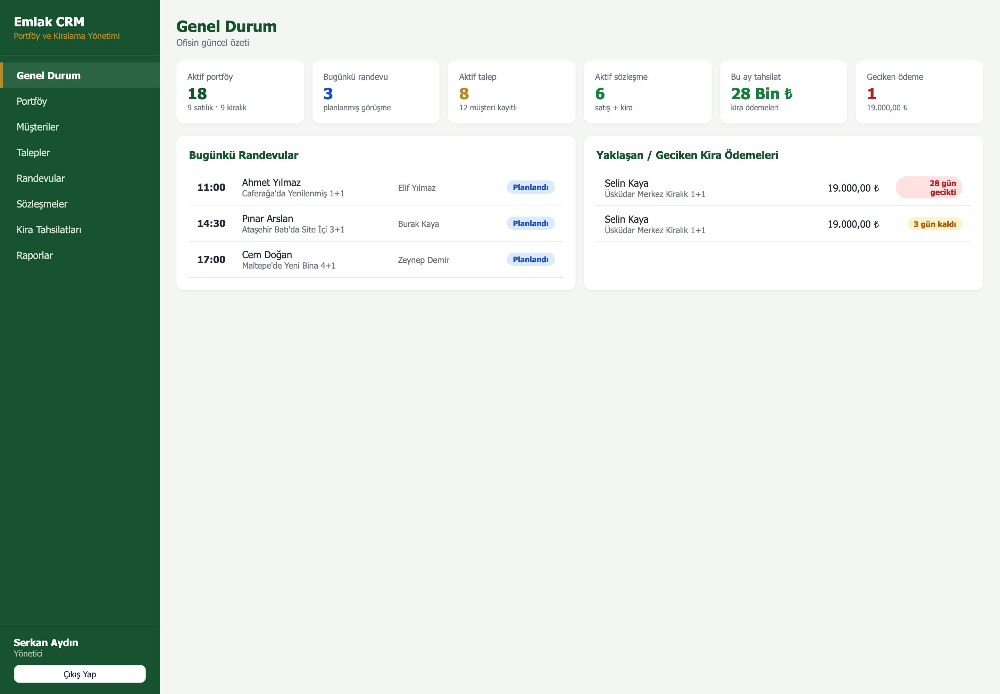
*Genel durum — bugünkü randevular ve kira hatırlatmaları*

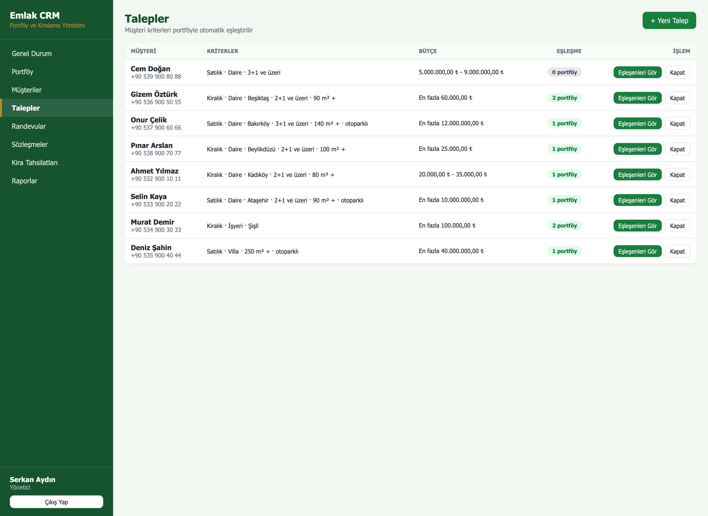
*Talepler — her satırda kaç portföyle eşleştiği görünür*

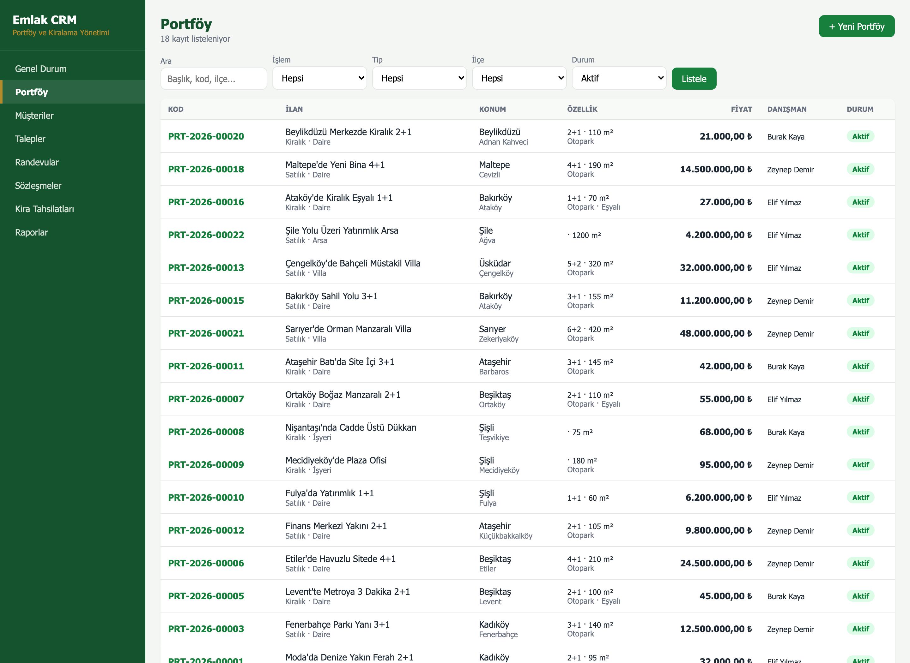
*Portföy listesi ve filtreler*

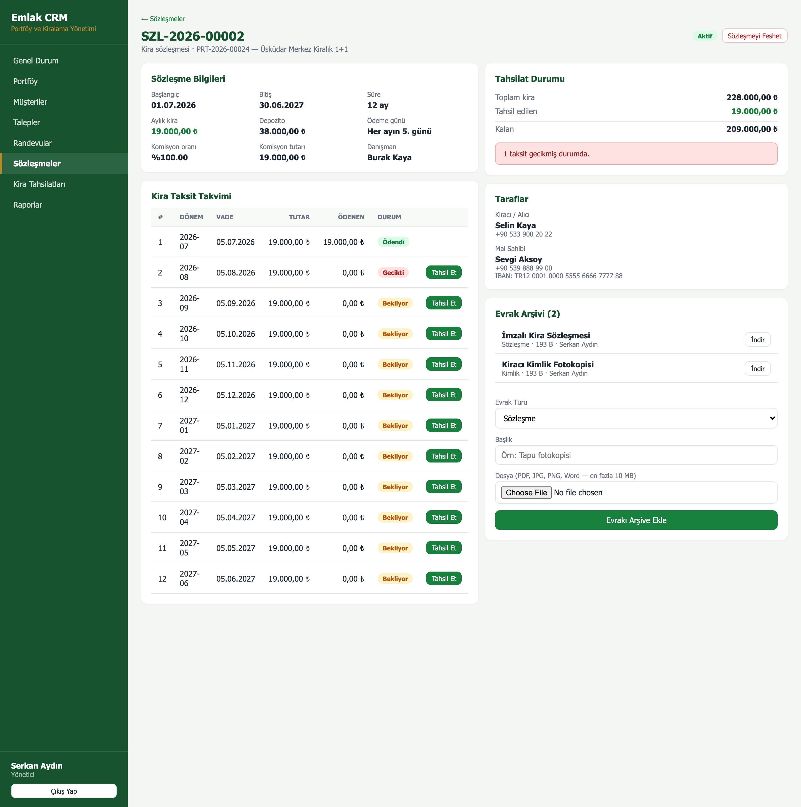
*Sözleşme detayı — otomatik taksit takvimi, tahsilat durumu ve evrak arşivi*

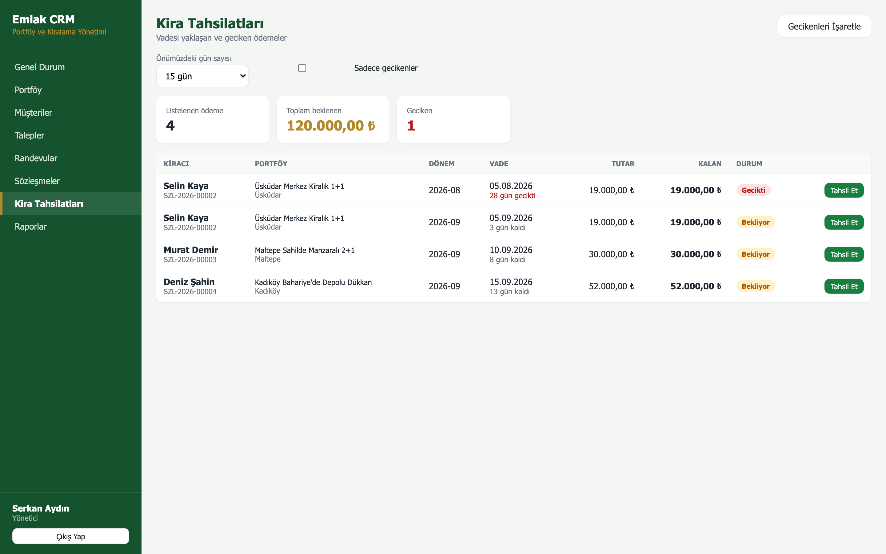
*Kira tahsilatları — geciken ve yaklaşan ödemeler*

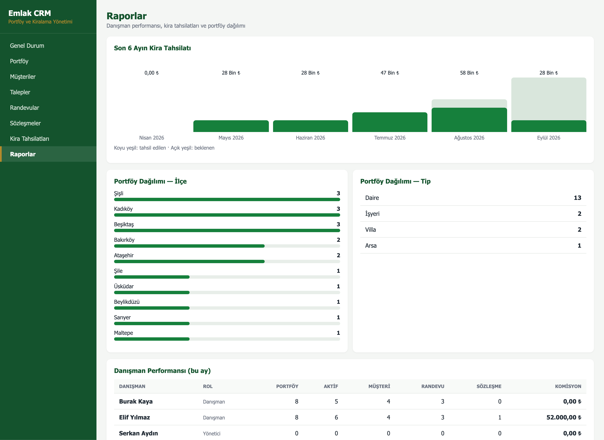
*Raporlar — tahsilat grafiği, portföy dağılımı, danışman performansı*

### Danışman Uygulaması

| | | |
|---|---|---|
| 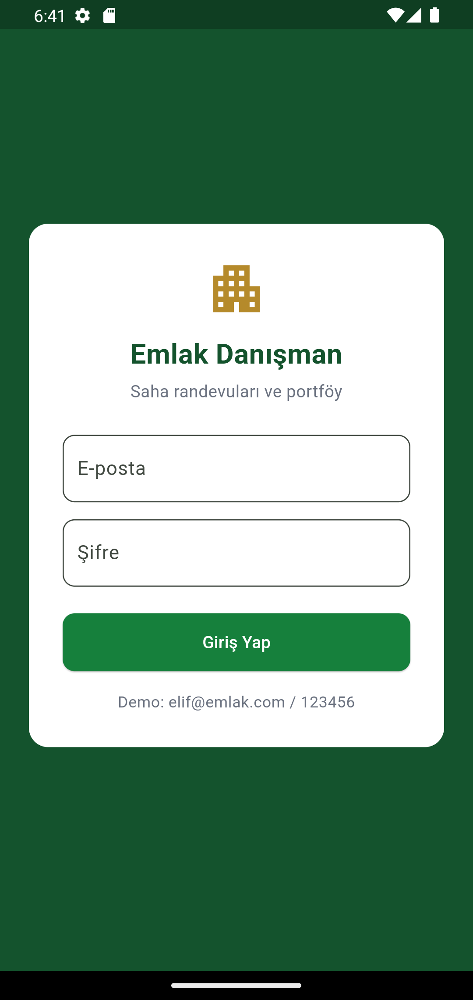 | 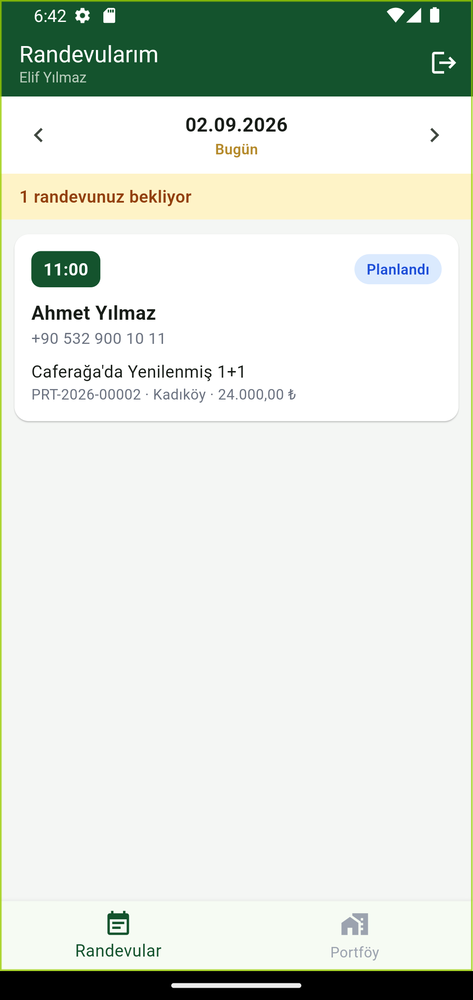 | 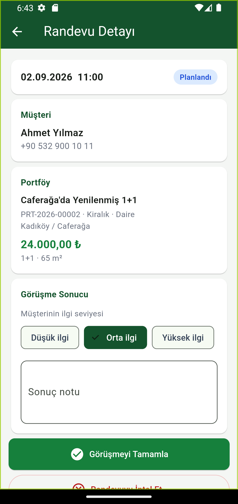 |
| Giriş | Günlük randevu ajandası | Görüşme sonucu girme |
| 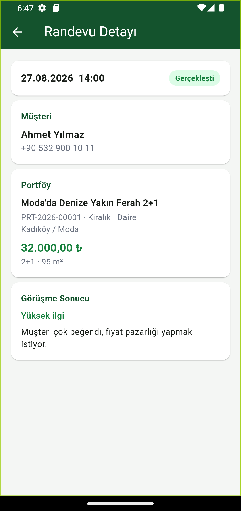 | 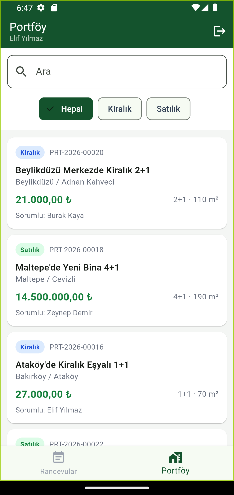 | |
| Tamamlanan randevu | Sahada portföy arama | |

---

## Demo Hesapları

Şifre: **123456**

| E-posta | Ad | Rol |
|---------|-----|-----|
| `admin@emlak.com` | Serkan Aydın | Yönetici |
| `elif@emlak.com` | Elif Yılmaz | Danışman |
| `burak@emlak.com` | Burak Kaya | Danışman |
| `zeynep@emlak.com` | Zeynep Demir | Danışman |

---

## Veritabanı Tabloları

| Tablo | İçerik |
|-------|--------|
| `users` | Personel: admin, danışman |
| `owners` | Mal sahipleri (IBAN dahil — kira aktarımı için) |
| `properties` | Portföy/ilan kayıtları, durum, fiyat, konum, özellikler |
| `customers` | Alıcı / kiracı adayları |
| `demands` | Müşteri talepleri (eşleştirme kriterleri) |
| `appointments` | Görüntüleme randevuları, sonuç ve ilgi seviyesi |
| `contracts` | Satış ve kira sözleşmeleri, komisyon |
| `installments` | Kira taksit takvimi ve tahsilatlar |
| `documents` | Evrak arşivi (dosya diskte, kayıt veritabanında) |

---

## API Uçları

### Kimlik

| Metot | Uç | Açıklama |
|-------|-----|----------|
| POST | `/api/auth/login` | Giriş, Sanctum token döner |
| GET | `/api/auth/me` | Token sahibinin bilgileri |
| POST | `/api/auth/logout` | Token'ı iptal eder |
| GET | `/api/agents` | Danışman listesi |

### Portföy ve müşteri

| Metot | Uç | Açıklama |
|-------|-----|----------|
| GET | `/api/properties` | Filtreli portföy listesi |
| POST | `/api/properties` | Yeni portföy (kod otomatik: `PRT-2026-00001`) |
| GET | `/api/properties/{id}` | Detay + randevu geçmişi |
| PUT | `/api/properties/{id}` | Güncelleme (durum değişikliği dahil) |
| DELETE | `/api/properties/{id}` | Silme (sadece yönetici, randevusu yoksa) |
| GET | `/api/properties/districts` | Filtre için ilçe listesi |
| GET/POST | `/api/owners` | Mal sahipleri |
| GET/POST | `/api/customers` | Müşteriler |

### Talep ve randevu

| Metot | Uç | Açıklama |
|-------|-----|----------|
| GET | `/api/demands` | Talepler + eşleşme sayısı |
| POST | `/api/demands` | Yeni talep |
| GET | `/api/demands/{id}/matches` | **Otomatik eşleştirme** |
| PUT | `/api/demands/{id}/close` | Talebi kapat |
| GET | `/api/appointments` | Randevular (`mine`, `date`, `from`, `to`) |
| POST | `/api/appointments` | Yeni randevu (çakışma kontrollü) |
| PUT | `/api/appointments/{id}/complete` | Sonuç girme |
| PUT | `/api/appointments/{id}/cancel` | İptal |

### Sözleşme, taksit, evrak

| Metot | Uç | Açıklama |
|-------|-----|----------|
| GET | `/api/contracts` | Sözleşmeler |
| POST | `/api/contracts` | Yeni sözleşme (**kirada taksit takvimi otomatik**) |
| GET | `/api/contracts/{id}` | Detay + taksitler + toplamlar |
| PUT | `/api/contracts/{id}/terminate` | Fesih |
| GET | `/api/installments` | Taksitler (`reminders=1&days=15` hatırlatma) |
| PUT | `/api/installments/{id}/pay` | Tahsilat (kısmi ödeme destekli) |
| POST | `/api/installments/refresh-overdue` | Vadesi geçenleri işaretle |
| GET/POST | `/api/documents` | Evrak listesi / yükleme |
| GET | `/api/documents/{id}/download` | İndirme |
| DELETE | `/api/documents/{id}` | Silme (sadece yönetici) |

### Rapor

| Metot | Uç | Açıklama |
|-------|-----|----------|
| GET | `/api/reports/summary` | Panel özeti |
| GET | `/api/reports/agents` | Danışman performansı |
| GET | `/api/reports/collections` | Son 6 ayın tahsilatı |
| GET | `/api/reports/portfolio` | İlçe ve tip dağılımı |

---

## Kurulum

Adım adım kurulum için **[KURULUM.md](KURULUM.md)** dosyasına bakın.
