# Kargo & Son Kilometre Dağıtım

Dört şubeli bir kargo firmasının gönderi kabulünden kapıda ödeme
mutabakatına kadar tüm sürecini yöneten sistem.

**Akış:** gönderi girişi → barkod ve toplu etiket basımı → şube ayrıştırma →
irsaliye ile kuryeye zimmet → OTP + imzalı teslimat → kapıda ödeme tahsilatı →
tacir portalında takip.

---

## Sistem Mimarisi

```
                        ┌──────────────────────────┐
                        │   MongoDB (yerel)        │
                        │   courier_db             │
                        └────────────┬─────────────┘
                                     │
                        ┌────────────┴─────────────┐
                        │  Express 5 REST API      │
                        │  JWT + bcrypt            │
                        │  http://localhost:3108   │
                        └───┬───────────┬──────┬───┘
                            │           │      │
        ┌───────────────────┘           │      └──────────────────┐
        │                               │                         │
┌───────┴────────┐          ┌───────────┴────────┐    ┌───────────┴────────┐
│ Şube Masaüstü  │          │  Tacir Portalı     │    │ Kurye Uygulaması   │
│ Electron+React │          │  React + Vite      │    │ React Native/Expo  │
│ barkod & irsal.│          │  :5108             │    │ OTP + imza + COD   │
└────────────────┘          └────────────────────┘    └────────────────────┘
```

---

## Kullanılan Teknolojiler

| Katman | Teknoloji |
|--------|-----------|
| Veritabanı | MongoDB 4.4+ (yerel kurulum), Mongoose 9 |
| API | Node.js + Express 5, Mongoose, JWT, bcryptjs |
| Masaüstü | Electron 44 + React 19 + Vite |
| Web | React 19 + Vite |
| Mobil | React Native / Expo SDK 57, react-native-svg |

---

## Projenin Özü

### 1. Barkod üretimi ve etiket basımı

Her gönderiye `KRG26000001` biçiminde barkod verilir (KRG + yılın son iki
hanesi + sıra numarası). Etiketteki barkod **Code 39** biçiminde,
hazır kütüphane kullanılmadan SVG olarak çizilir:

```js
// Code 39: her karakter 5 siyah + 4 beyaz çubuk, 3'ü geniş
const DESENLER = { '0': 'nnnwwnwnn', '1': 'wnnwnnnnw', /* ... */ }
```

Kabul edilen gönderiler ekranda birikir, **"N Etiketi Yazdır"** ile hepsi
tek seferde basılır (`@media print` kuralları menüyü ve formu gizler).

### 2. Şube ayrıştırma

Şubelerin hizmet ilçeleri `branches.districts` alanında virgülle tutulur.
Gönderi kaydedilirken alıcının ilçesine bakılıp **dağıtım şubesi otomatik
belirlenir**; hiçbir şube o ilçeye bakmıyorsa kayıt reddedilir:

```
"Ankara Çankaya" ilçesine hizmet veren bir şube yok. Şube tanımlarını kontrol edin.
```

Ayrıştırma ekranı bekleyen gönderileri şubeye göre gruplar; buradan
**şubeye sevk** veya **kuryeye dağıtım** irsaliyesi kesilir.

### 3. Teslimat doğrulama: OTP + imza

Gönderi kuryeye zimmetlendiği anda 6 haneli bir **teslimat kodu** üretilir
(gerçek hayatta alıcıya SMS ile gider). Kurye teslim ederken bu kodu
girmek zorundadır:

```js
if (!otp || otp.trim() !== gonderi.otp_code) {
  return res.status(400).json({
    message: 'Teslimat kodu hatalı. Alıcıdan kodu tekrar isteyin.' });
}
```

Ayrıca **teslim alan kişinin adı** ve **parmakla atılan imza** zorunludur.
İmza, `PanResponder` ile toplanan noktaların SVG yoluna çevrilmesiyle
oluşturulur ve metin olarak saklanır.

Teslimat başarılı olduğunda kod silinir; başarısız olursa deneme sayısı
artar ve **3. denemeden sonra gönderi otomatik olarak iadeye ayrılır**.

### 4. Kapıda ödeme (COD) ve mutabakat

Kapıda ödemeli gönderiler kurye ekranında turuncu kutuyla vurgulanır.
Teslimat tamamlanınca tahsilat kaydı açılır (aynı transaction içinde).
Tacir portalındaki mutabakat ekranı toplam tahsilatı, firmanın komisyon
oranını ve **hesaba aktarılacak net tutarı** gösterir.

### 5. Hareket geçmişi

Her durum değişikliği `shipment_events` tablosuna yazılır. Barkod
sorgulandığında zaman çizelgesi olarak dönerse hem şube personeli hem tacir
gönderinin nerede olduğunu görür.

---

## Özellikler

### Şube Masaüstü (Electron)

- **Genel Durum** — bugün alınan/teslim edilen, şubede bekleyen, dağıtımda,
  kapıda ödeme toplamları, 7 günlük grafik, şube ve kurye performansı
- **Gönderi Kabul** — tacir seçimi, otomatik ücret hesabı (taban + desi),
  otomatik şube ayrıştırma, barkodlu etiketlerin toplu basımı
- **Şube Ayrıştırma** — şube kartları, gönderi seçimi, kurye/şube irsaliyesi
- **İrsaliyeler** — barkodlu, imza alanlı yazdırılabilir sevk fişi
- **Gönderi Arama** — barkod/alıcı araması, şubeye kabul, hareket geçmişi

### Tacir Portalı (React)

- Kendi gönderilerinin durum dağılımı ve 7 günlük grafiği
- Gönderi listesi ve zaman çizelgeli takip ekranı
- Portaldan yeni gönderi oluşturma (barkod ve şube otomatik)
- **Kapıda Ödeme Mutabakatı** — tahsil edilen, komisyon, net bakiye

### Kurye Uygulaması (React Native)

- Zimmetli gönderiler, tahsil edilecek toplam, bugün teslim edilenler
- Teslimat ekranı: kapıda ödeme vurgusu, ödeme yöntemi seçimi
- 6 haneli teslimat kodu doğrulaması (demo için kodu gösterme seçeneği)
- Parmakla imza alma (SVG)
- Teslim edilemedi kaydı (sebep zorunlu)

---

## Ekran Görüntüleri

### Şube Masaüstü Uygulaması

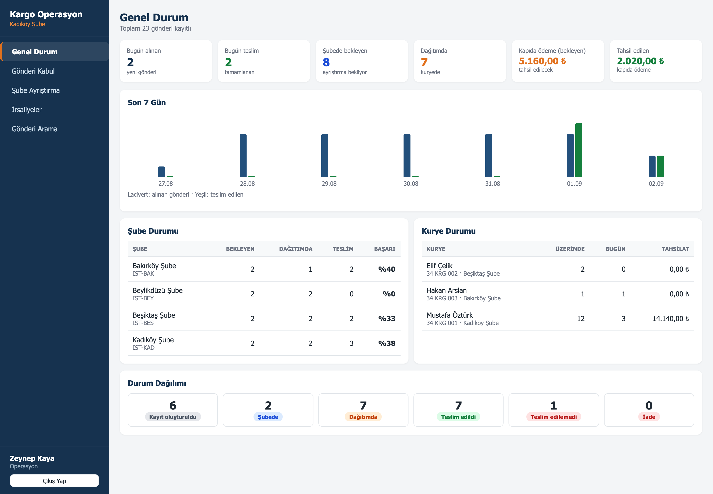
*Genel durum — şube ve kurye performansı*

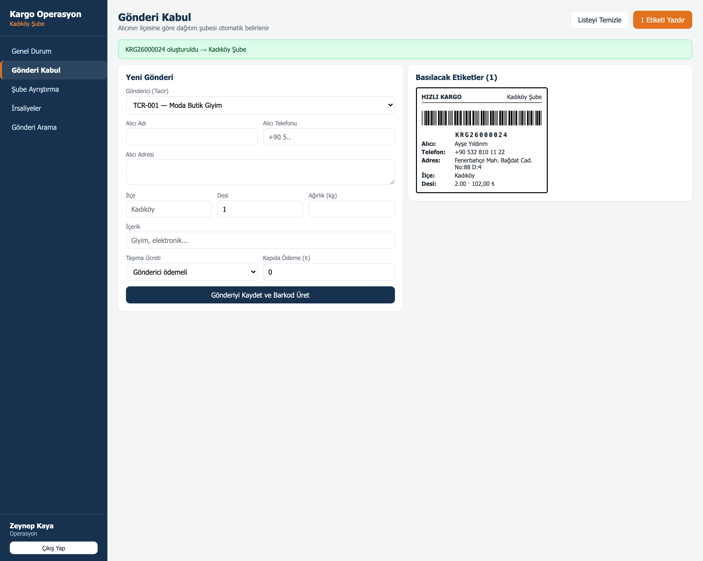
*Gönderi kabul — kaydedilen her gönderi için Code 39 barkodlu etiket*

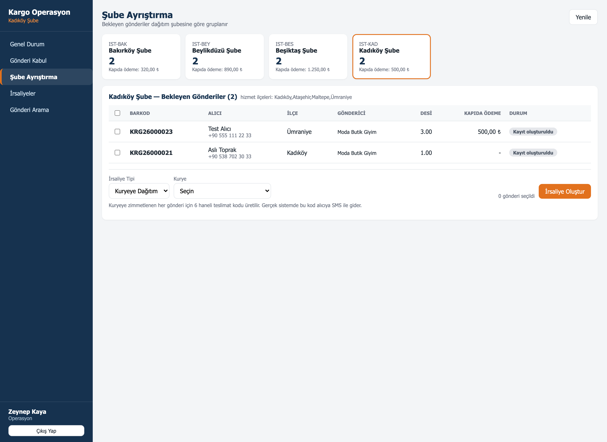
*Şube ayrıştırma — bekleyen gönderiler dağıtım şubesine göre gruplanır*

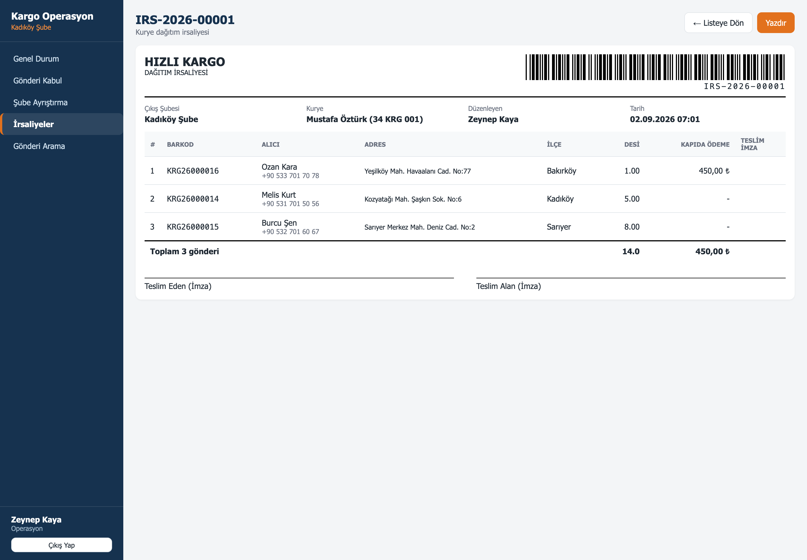
*Dağıtım irsaliyesi — barkodlu, imza alanlı, yazdırılabilir*

### Tacir Portalı

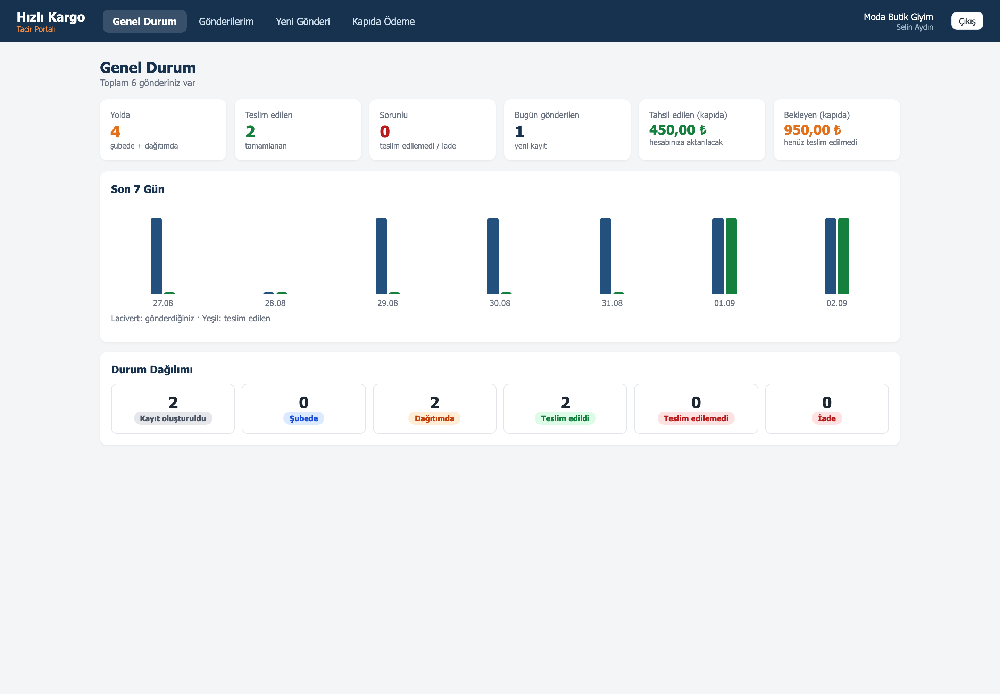
*Tacir genel durumu*

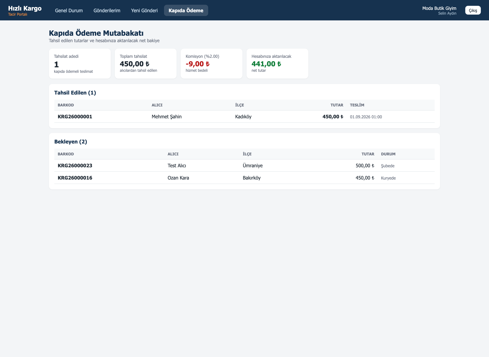
*Kapıda ödeme mutabakatı — komisyon ve net bakiye*

### Kurye Uygulaması

| | | |
|---|---|---|
| 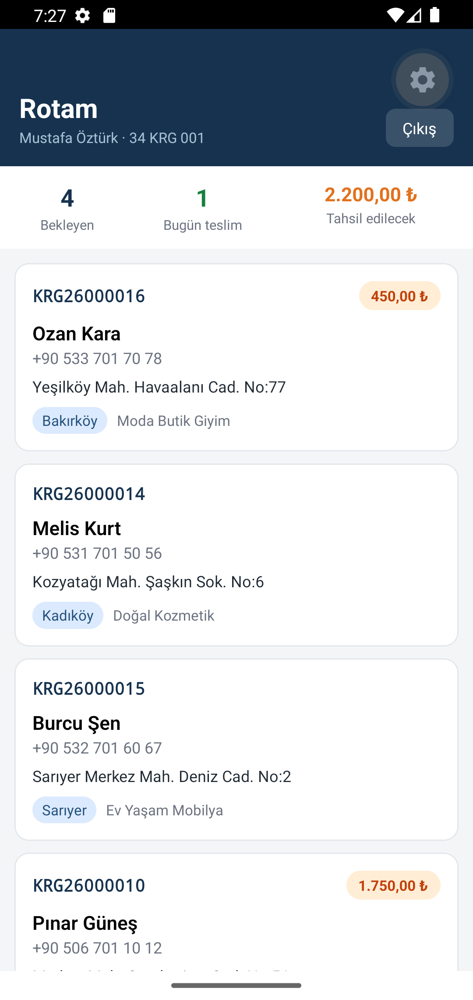 | 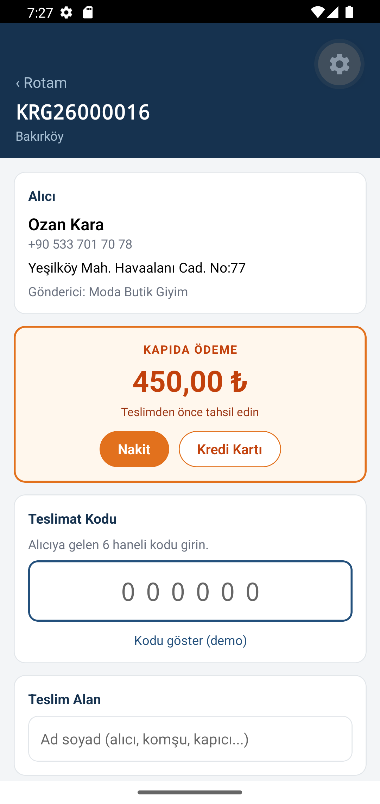 | 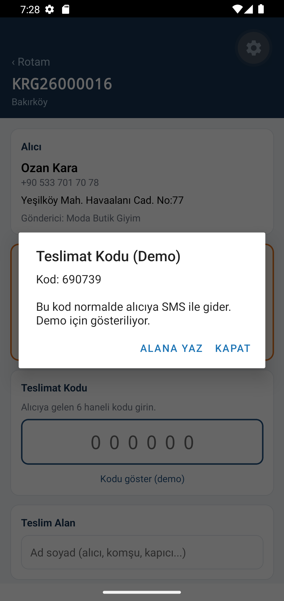 |
| Zimmetli gönderiler | Teslimat ekranı | Teslimat kodu (demo) |
| 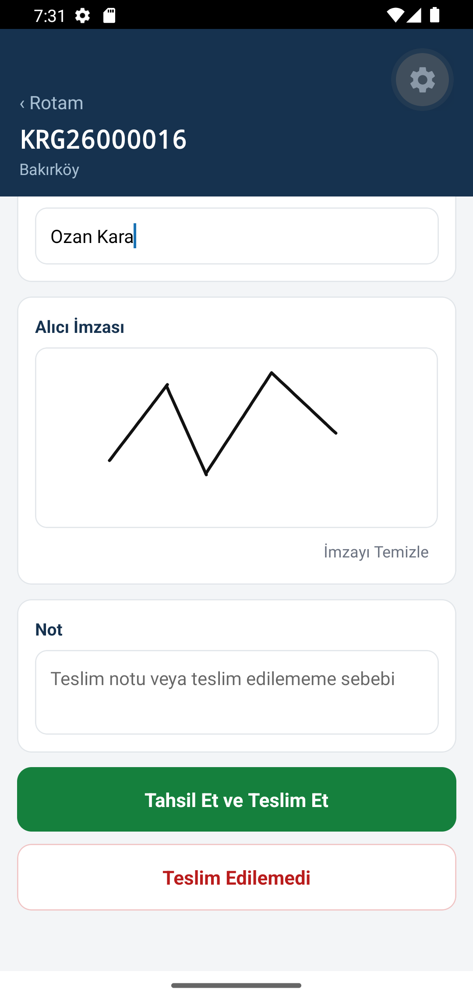 | 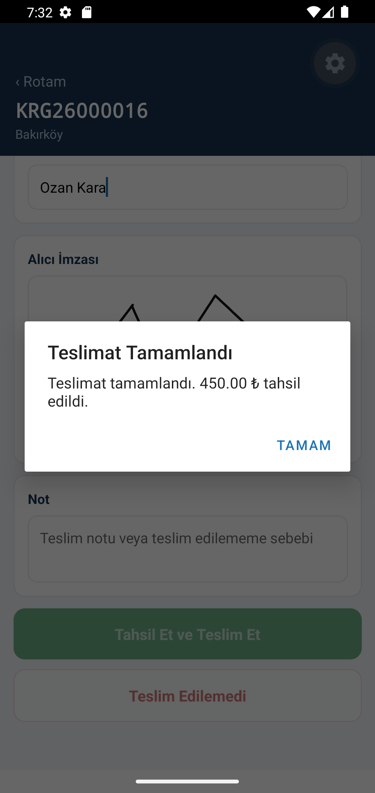 | |
| Parmakla imza | Teslimat + tahsilat tamam | |

---

## Demo Hesapları

Şifre: **123456**

| Kullanıcı | Rol | Uygulama |
|-----------|-----|----------|
| `admin` / `operasyon` / `op2` | Yönetici / Operasyon | Şube masaüstü |
| `kurye1` / `kurye2` / `kurye3` | Kurye | Mobil |
| `tacir1` / `tacir2` | Tacir | Tacir portalı |

---

## Veritabanı (MongoDB)

Alan tanımları `apps/api/models/` klasöründeki Mongoose şemalarındadır.
Ayrıntılı açıklama: [`db/README.md`](db/README.md)

| Koleksiyon | İçerik |
|------------|--------|
| `branches` | Şubeler ve hizmet verdikleri ilçeler |
| `merchants` | Tacirler, anlaşmalı fiyat ve komisyon oranı |
| `users` | Personel (admin, operasyon, kurye) ve tacir kullanıcıları |
| `shipments` | Gönderiler: barkod, alıcı, ücret, kapıda ödeme, durum, OTP, imza |
| `shipmentevents` | Hareket geçmişi |
| `manifests` | Sevk ve dağıtım irsaliyeleri (gönderiler `items` dizisinde) |
| `codcollections` | Kapıda ödeme tahsilatları |

İlişkisel tasarımdaki `manifest_items` ara tablosuna gerek kalmadı;
irsaliyeye ait gönderi kimlikleri belgenin içinde bir dizide tutuluyor.

---

## API Uçları

### Kimlik ve tanımlar

| Metot | Uç | Açıklama |
|-------|-----|----------|
| POST | `/api/auth/login` | Giriş, JWT döner |
| GET | `/api/auth/me` | Token sahibinin bilgileri |
| GET | `/api/auth/branches` | Şubeler |
| GET | `/api/auth/merchants` | Tacirler |
| GET | `/api/auth/couriers` | Kuryeler |

### Gönderi

| Metot | Uç | Açıklama |
|-------|-----|----------|
| GET | `/api/shipments` | Filtreli liste (`q`, `status`, `destBranchId`, `cod`) |
| POST | `/api/shipments` | Yeni gönderi (barkod + şube otomatik) |
| GET | `/api/shipments/barcode/:barcode` | Takip: gönderi + hareketler + tahsilat |
| POST | `/api/shipments/:id/accept` | Şubeye kabul |
| GET | `/api/shipments/sorting/summary` | Şube ayrıştırma özeti |

### İrsaliye ve teslimat

| Metot | Uç | Açıklama |
|-------|-----|----------|
| GET | `/api/manifests` | İrsaliye listesi |
| POST | `/api/manifests` | Toplu irsaliye (kuryede OTP üretir) |
| GET | `/api/manifests/:id` | Basım için detay |
| GET | `/api/delivery/my-route` | Kuryenin rotası |
| GET | `/api/delivery/:id/otp` | Teslimat kodu (demo) |
| POST | `/api/delivery/:id/deliver` | OTP + imza + COD ile teslim |
| POST | `/api/delivery/:id/fail` | Teslim edilemedi |

### Rapor

| Metot | Uç | Açıklama |
|-------|-----|----------|
| GET | `/api/reports/summary` | Genel özet (tacirler kendi rakamlarını görür) |
| GET | `/api/reports/branches` | Şube performansı |
| GET | `/api/reports/couriers` | Kurye performansı |
| GET | `/api/reports/cod-settlement` | Kapıda ödeme mutabakatı |
| GET | `/api/reports/daily` | Son 7 gün |

---

## Kurulum

Adım adım kurulum için **[KURULUM.md](KURULUM.md)** dosyasına bakın.
